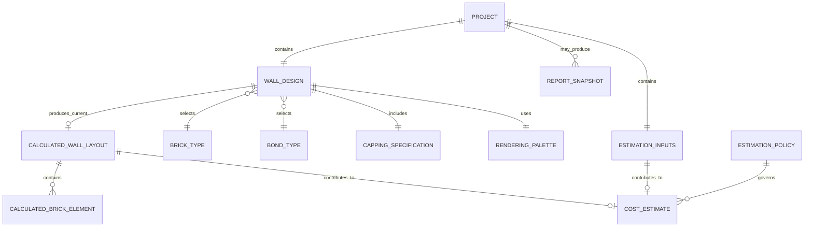

# 02 Data Discovery and Conceptual Model Report

> 分析对象：`BrickWallDesigner_v18.html`  
> 证据状态：**Confirmed**＝源代码确认；**Inferred**＝证据支持的推断；**Unknown**＝无法确认。  
> **候选业务实体不等于最终数据库表。** 本报告不规定最终表、列、主外键、数据库类型、索引、SQL、API 或实现。

# 1. 数据域分类 Data Domain Classification

| 数据名称 | 业务含义/类型/示例 | 来源 | 分类与理由 | 置信度/人工确认 |
|---|---|---|---|---|
| Project metadata | 项目名、appName/version、savedAt；string/datetime | Save JSON | Snapshot/Audit metadata；标识一次文件保存 | **Confirmed / High**；版本与审计语义需确认 |
| Wall design inputs | 长、高、砂浆厚度、砖型、bond、切砖、调整方向、压顶；number/code/boolean-like | Designer UI | Persistent design input；可恢复业务设计 | **Confirmed / High** |
| Wall construction | 双层 `2` | hidden + 固定 getter | Configuration/Persistent input；当前不可编辑且实现固定 | **Confirmed / High**；未来是否可变需确认 |
| Render colours | 7 个 hex colour | hidden HTML input | Configuration/Persistent design input；影响图形，不影响计算 | **Confirmed / High**；是否属业务数据需确认 |
| Brick catalogue | 5 codes/names/dimensions | `BRICK_TYPES`,`BRICK_NAMES` | Reference data；设计选择和计算共同读取 | **Confirmed / High** |
| Bond catalogue | 7 codes/labels | radio values、`NAMES`、`ALL_BOND_VALUES` | Reference data；允许值 | **Confirmed / High** |
| Capping options | yes/no、orientation、offset | radios | Reference values + persistent design input | **Confirmed / High** |
| Estimation overrides | 清场、基础、材料、损耗、价格、人工等 34 个可选 number strings | Page 2 `u_*` | Persistent design input / configuration override | **Confirmed / High** |
| RenoPilot defaults | 默认成本与工程参数 | `userOrDefault` literals / UI labels | Configuration data；空输入时使用 | **Confirmed / High**；来源、地域、有效期 **Unknown** |
| Calculation parameters | 水泥/石灰/砂密度、GST 算法、搜索步长/容差 | JS literals | Configuration/Derived rule；目前硬编码 | **Confirmed / High**；业务治理 **Unknown** |
| Layout geometry | actual length/height、courses、brick x/y/type arrays | `calculateLayout` | Derived data；由输入重算 | **Confirmed / High** |
| Wall summary `WALL` | 尺寸、砖型数量、bond、ready | `drawWall` | Derived application state；跨页传递 | **Confirmed / High** |
| Material quantities | footing、mesh、steel、bricks、mortar、mass | `recalculateCosts` | Derived data | **Confirmed / High** |
| Cost estimate | 材料、人工、总额、GST component | `recalculateCosts` | Derived transactional-like result；当前不持久化 | **Confirmed / High**；是否需作为报价快照需确认 |
| SVG/report | SVG、HTML report、显示文本 | render/populate/print | Display-only / derived snapshot candidate | **Confirmed / High** |
| Diagnostics inputs/results | 范围、step、failures | diagnostics modal | Temporary UI state / test data | **Confirmed / High** |
| UI navigation/zoom/collapse/status | 当前页、scale、展开状态、消息 | DOM/locals | Temporary UI state | **Confirmed / High** |
| User/account/ownership | 用户身份、客户、权限 | 未发现 | Unknown data；代码没有该域 | **Unknown / Low**；必须人工确认 |
| Audit history/version history | 谁、为何修改、历史版本 | 未发现 | Unknown；savedAt 不是完整审计 | **Unknown / Low**；必须人工确认 |

# 2. Reference 和配置数据

## 2.1 Brick types

用途：决定砖长度、宽度、高度、label、布局、最短墙长、数量和成本基础。来源 L2150-L2163，使用于 `getBrick`、layout、diagnostics、render/report。

| code | name | length mm | width mm | height mm |
|---|---|---:|---:|---:|
| s | Standard | 230 | 110 | 76 |
| l | Slimline | 290 | 90 | 47 |
| u | Utility | 290 | 90 | 76 |
| m | Modular | 190 | 90 | 90 |
| r | Roman | 290 | 90 | 40 |

记录数：5。更新方式：修改源文件；无管理 UI/API。Application 专用或共享：当前专用；砖规格是未来共享参考数据候选，需产品/工程确认。测试数据：未标记为测试。**Confirmed**。

## 2.2 Bond types

字段：code、display label；记录数 7：stretcher、header、english、englishGardenWall、flemish、flemishGardenWall、common。来源 L1063-L1076、L4752-L4760、L5158-L5166；不同 bond 驱动不同布局和最短长度公式。更新方式：源代码。未来共享：可能，但规则实现与本应用紧耦合。**Confirmed/Inferred**。

## 2.3 Colours

数据集字段：用途 code、hex value。7 项：C1 `#C1440E`、C2 `#A63A0C`、C6 `#8B3A0C`、C3 `#8B6914`、C4 `#AE0000`、C5 `#D4C8B0`、CHR `#710000`；映射到 odd/even/header/special/cut/mortar/capping。来源 L1115-L1121、L4997-L5008。隐藏但保存；没有 UI 更新方式。当前应用专用。**Confirmed**。

## 2.4 Product/components/options

- Materials/components：road base、reinforcing steel、concrete、bricks、cement、lime、sand；7 项。**Confirmed**。
- Labour/allowances：site access、waste disposal、prepare work area、trench excavation、road base compaction、concrete pour、bricklaying；7 个成本类别，并有 5 个 minimum charge。**Confirmed**。
- Capping：none/yes；orientation flat/vertical/soldier；offset yes/no。**Confirmed**。
- Construction skin count：2，所有墙固定 double skinned。**Confirmed**。

这些不是外部产品目录；只有标签与算法参数，缺少供应商、SKU、地区、币种有效期等。其共享能力 **Unknown**。

## 2.5 Units, defaults and calculation parameters

| 数据集 | 字段/示例 | 数量 | 更新/共享/测试 |
|---|---|---:|---|
| Geometry units | mm、m、m²、m³、count | 5 类 | 代码固定；可能共享；非测试 |
| Cost units | $、$/m²、$/m³、$/kg、$/brick、$/length | 6 类 | “$” 未声明币种；GST 文案暗示澳洲但币种仍需确认 |
| Engineering defaults | side 1500mm、end 2000mm、footing extension 100mm、ratio 4、mesh inset 50mm、layers 2、road base 100mm、compaction 10%、steel 8m、contingencies 10% | 10 | `userOrDefault`；源文件更新；未来配置候选 |
| Mortar mix | 1:0:4 | 3 parts | 源文件更新 |
| Densities | cement 1440、lime 500、sand 1600 kg/m³ | 3 | 硬编码；来源/标准 **Unknown** |
| Material cost defaults | 50、18、400、2、0.5、1.1、0.1（按各单位） | 7 | 硬编码；地域/日期 **Unknown** |
| Labour defaults/minima | rates 0/50/20/50/2；minimums 0/500/0/500/1000；allowances 0/0 | 12 | 硬编码；地域/日期 **Unknown** |
| GST calculation | included GST component = grand total / 11 | 1 rule | 硬编码；税率/适用期未建模 |
| Diagnostic presets | min 600、max 10000、step 1、mortar 17、cuts-only true | 5 | Sample/test data；不持久化 |

# 3. 保存、加载、导入和导出数据结构

## 3.1 Save/Export JSON（Confirmed）

```text
project
├─ appName: "Brick Wall Designer"
├─ appVersion: "v16"
├─ projectName: user text
├─ savedAt: browser-generated ISO timestamp
└─ state
   ├─ values: map of 45 HTML element IDs to string values
   └─ radios: map of 6 radio names to selected string values
```

`values` 包含 BT、MJ、WL、WH、7 colours、sk_hidden，以及 34 个 `u_*` cost/calculation override。`radios` 包含 bond、cu、ad、cc、cco、ccoff。所有值来自 DOM `.value`，因此数值仍以 JSON string 保存。**Confirmed**。

## 3.2 Load/Import（Confirmed）

Load 只要求 JSON 可解析且访问 `project.state`；没有 schema validation、appName/version 校验、类型/范围验证。`applyProjectState` 只读取白名单字段：存在的值覆盖当前 DOM，缺失值保留现状，未知字段忽略；radio 精确匹配 value；之后重绘/重算。项目名恢复到 `sp_name`；savedAt 仅转本地显示；appName/appVersion 不读取。

## 3.3 对称性与缺口

| 检查 | 结论 |
|---|---|
| Save/Load 字段对称 | `state.values` 与 `state.radios` 使用相同清单，**Confirmed 对称**。 |
| Import/Export 对称 | 项目 JSON 下载与上传构成同一格式，**Confirmed statically**；实际往返 **Unknown**。 |
| 只读不保存 | appName/appVersion 在 Load 不使用；savedAt 只显示；派生 `WALL`/layout/report/costs 不保存；诊断与 UI state 不保存。**Confirmed**。 |
| 保存但不能恢复 | `sk_hidden` 会赋回 DOM，但业务 getter 固定 2，非 2 值不能影响计算；颜色可以恢复并影响渲染。**Confirmed**。 |
| 旧版本兼容 | 无显式迁移；缺字段容忍、未知字段忽略提供有限兼容。**Confirmed/Inferred**。 |
| 默认补充 | 缺字段不会补 schema default，而保留当前 HTML 值；空成本输入在计算时由 `userOrDefault` 补默认。**Confirmed**。 |
| Local/Session/IndexedDB | 结构不存在。**Confirmed**。 |
| API request/response | 结构不存在。**Confirmed**。 |
| Report export | 临时 HTML + SVG clone + browser print；不是 JSON project export。**Confirmed**。 |

# 4. 数据血缘 Data Lineage

| Data item | Source | UI control | JS variable | Transformation | Persistence location | Reload path |
|---|---|---|---|---|---|---|
| Project name | user | `sp_name` | `nameInput` | trim；filename sanitize 另行处理 | root `projectName` + filename | `project.projectName` → `sp_name` |
| Saved time | browser clock | none | `savedAt` | ISO string；load 时 locale display | root `savedAt` | status text only |
| Wall length | user/default | `WL` | `enteredLength` | parseFloat/fallback 1235；bond/cuts 可调整 actual length | `state.values.WL` | apply value → draw → `WALL.length` |
| Wall height | user/default | `WH` | entered height / layout `eH` | rows/course geometry | `state.values.WH` | apply → draw |
| Mortar | user/default | `MJ` | `mortar` | parseFloat；0/NaN fallback 10 | `state.values.MJ` | apply → layout/cost |
| Brick type | user | `BT` | brick code → `BRICK_TYPES[code]` | dimensions/label lookup | `state.values.BT` | apply → lookup |
| Bond | user | `bond` radios | `bondType` | branch to bond algorithm/label | `state.radios.bond` | apply checked → layout |
| Cut/adjust | user | `cu`,`ad` | boolean/code | actual length and cut brick formulas | radios | apply → layout |
| Capping | user | `cc`,`cco`,`ccoff` | booleans/code | conditional course geometry/counts | radios | apply → change UI → layout |
| Colours | embedded defaults | hidden `C*` | `colorMap` | map brick type to SVG fill | values map | apply → render |
| Estimation override | user or blank | `u_*` | local number | blank→default；parseFloat；unit conversion | values map | apply → recalculate |
| Brick geometry | design inputs/reference | none | `layout.wallBricks/ccBricks` | bond formulas, cuts, coordinates | not persisted | recompute after Load |
| Brick counts | layout | display only | `counts`,`WALL` | category counts × skin/type multipliers | not persisted | recompute |
| Materials | WALL + overrides/defaults | display `cv_*` | cost locals | conversions, ceilings, mix/density | not persisted | recompute |
| Cost total/GST | quantities + rates | display `rp_*` | totals | sum; minima via `Math.max`; GST total/11 | not persisted | recompute |
| Report | SVG/WALL/cost DOM | report page | cloned SVG/HTML | format/display/print | browser print target only | no application reload path |

# 5. Source of Truth 和数据所有权

| 数据类 | 当前 Source of Truth / 创建与修改 | Readers | 重复/冲突风险 | 未来候选 |
|---|---|---|---|---|
| 当前设计输入 | 活跃 DOM；用户修改；保存文件是离线快照 | layout、save | 多个 JSON 副本无同步/唯一性；DOM 与最近下载文件可分叉 | **Inferred**：受管 Project/Design repository |
| Brick/bond reference | 源代码常量与 HTML option/radio（砖名/值有重复定义） | UI、layout、diagnostics、report | code/label/dimension 多处重复，可能漂移 | **Inferred**：共享、版本化 reference catalogue |
| Defaults/rates | JS literals + HTML display文案 | cost engine/UI | 显示值与算法值可不一致；无地区/日期 | **Inferred**：版本化 estimation policy/configuration |
| 派生 layout/counts | 当前计算引擎 | render/cost/report | 不保存，重载后可能因新版本算法而变化 | 当前算法；若需可重现则保存版本/快照 |
| Cost estimate | 当前 DOM/locals | report | 无持久结果；默认更新会改变旧项目重算值 | **Inferred**：可选 Estimate snapshot + policy version |
| Project JSON | 用户文件系统 | Load | 文件名、内容、重复副本、并发修改无控制 | **Inferred**：应用管理的项目存储 |
| User/owner | 不存在 | 无 | 无法归属、授权或按用户查询 | **Unknown**：身份/组织系统 |

“数据由谁创建/修改”在代码中只有匿名浏览器用户和应用算法；不存在已确认的个人、团队或系统账户。跨 application 使用均未实现。

# 6. 持久化需求 Persistence Requirements

| 数据 | 长期保存/原因 | 可重算 | 历史/快照 | 删除/归档/审计 | 共享 | 状态 |
|---|---|---|---|---|---|---|
| Project name/metadata | 是；定位设计文件 | 否（名称） | savedAt 已有单点快照；版本需求未知 | 策略未知；审计候选 | 可能 | **Confirmed current persistence; future rules Inferred/Unknown** |
| Design inputs | 是；恢复设计 | 否（用户选择） | 若需回溯应版本化 | 删除/归档/审计规则未知 | 应用专用为主 | **Confirmed** |
| Estimation overrides | 是；影响结果与重算 | 否（用户输入） | 与设计版本一起 | 同上 | 可能共享个人/组织偏好，**Unknown** | **Confirmed current persistence** |
| Reference catalogues | 当前随代码长期存在 | 不应由项目重算 | 规格变化时版本需求 **Inferred** | 管理审计 **Inferred** | 强共享候选 | **Confirmed/Inferred** |
| Default estimation policy | 当前随代码存在 | 不能从项目推回 | 要复现旧估算需版本/生效期快照 | 更新审计 **Inferred** | 共享候选 | **Inferred** |
| Layout geometry/SVG | 当前不保存 | 是 | 只有法律/复现要求时才需快照 | 通常随设计删除 | 否 | **Confirmed current; future Unknown** |
| Material quantities/cost totals | 当前不保存 | 是，但依赖算法/default version | 报价/审批场景可能需不可变快照 | 保留/审计业务未知 | 报告系统可能读取 | **Inferred; human confirmation required** |
| Diagnostic state/results | 否；开发测试临时态 | 可重跑 | 无证据需要 | 可丢弃 | 否 | **Confirmed** |
| UI state | 否 | 可恢复默认 | 不需要 | 可丢弃 | 否 | **Confirmed/Inferred** |

# 7. 概念业务实体识别

再次明确：**候选业务实体不等于最终数据库表。**

| 候选实体/角色 | 业务含义与主要数据 | 独立身份/独立维护 | 所有者与生命周期 | 范围 | 证据 |
|---|---|---|---|---|---|
| Project | 命名的保存边界；projectName、application metadata、savedAt、design state | 当前只靠名称/文件，无稳定业务 ID；可独立 Save/Load | 匿名用户创建；文件生命周期外部管理 | 应用专用；可能成为 aggregate root | **Confirmed**：project JSON |
| Wall Design | 描述一面墙的持久输入：尺寸、砖/bond、切砖、压顶、颜色、construction | 在 Project 内无独立 ID；可整体修改 | Project 所有；Draft-like，无显式状态 | 应用专用 | **Confirmed** |
| Estimation Inputs | 工程参数、损耗、单价、人工、minimums 的用户覆盖 | 无独立 ID；随 Project 修改 | Wall Design/Project 的组成部分或 value object 候选 | 可能共享 preference，但未确认 | **Confirmed** |
| Brick Type | code/name/dimensions 参考实体 | code 提供业务标识候选；仅代码维护 | 应用发布版本管理 | 未来共享 | **Confirmed** |
| Bond Type | code/label 与算法选择 | code 提供业务标识候选；仅代码维护 | 应用发布版本管理 | 未来共享 | **Confirmed** |
| Capping Specification | 是否、orientation、offset | 无独立身份；Wall Design value object 候选 | 随设计创建/修改/删除 | 应用专用 | **Confirmed** |
| Rendering Palette | 砖类别颜色 | 无独立身份；配置/value object | 随项目保存 | 应用专用 | **Confirmed** |
| Estimation Policy | RenoPilot 默认参数、费率、密度、GST规则 | 当前无 ID/版本；逻辑上需可区分版本是推断 | 应用维护者 | 未来共享 | **Inferred** |
| Calculated Wall Layout | actual dimensions、courses、brick geometry/counts | 无独立身份；派生 snapshot 候选 | 引擎创建，设计变化即替换 | 应用专用 | **Confirmed derived** |
| Cost Estimate | 材料量、成本、总额、GST | 当前无持久身份；报告/审批若存在可成为历史实体 | 引擎创建；每次输入变化替换 | 可能共享到报告/项目系统 | **Inferred** |
| Report Snapshot | SVG + 摘要 +成本打印结果 | 当前只在打印窗口，无应用 ID | 即时生成，浏览器外部保存 | 可能共享 | **Inferred** |
| User/Customer/Site | 可能的业务主体 | 代码不存在 | Unknown | 可能跨应用 | **Unknown**；仅项目名帮助文字提到 client/site |

Aggregate root 候选是 Project；Wall Design 与 Estimation Inputs 当前共同保存在其 state 中。该归属是 **Inferred**，需下一阶段业务确认。

# 8. 实体关系和基数

1. 一个 **Project** 当前包含恰好一个 **Wall Design**；一个 Wall Design 由一个 Project 保存。**Confirmed for current JSON shape**。
2. 一个 Wall Design 选择恰好一个 Brick Type；一个 Brick Type 可被零个或多个 Wall Design 选择。**Confirmed**。
3. 一个 Wall Design 选择恰好一个 Bond Type；一个 Bond Type 可被零个或多个 Wall Design 选择。**Confirmed**。
4. 一个 Wall Design 包含一个 Capping Specification；当 include=no 时 orientation/offset 仍保存在 state，但业务上不生效。**Confirmed**。
5. 一个 Project 包含一组 Estimation Inputs；每个 override 可为空。**Confirmed**。
6. 一个 Wall Design 可产生零个或一个当前 Calculated Wall Layout（未 Draw 时为零）；每次重算替换当前 layout。**Confirmed**。
7. 一个 Calculated Wall Layout 包含零个或多个计算砖图元；它们没有独立持久身份。**Confirmed**。
8. 一个当前 layout 与一组 estimation inputs 可产生一个当前 Cost Estimate；若未 Draw，成本不可用。**Confirmed**。
9. 一个 Project 是否应拥有多个历史 Design Version、Estimate Snapshot 或 Report Snapshot：**Unknown**，当前应用不支持。
10. Project 与 User/Customer/Site 的关系：**Unknown**。

本阶段不生成 Foreign Key 实现。

# 9. CRUD Matrix

| Entity | Create | Read | Update | Delete/Archive | Actor or function |
|---|---|---|---|---|---|
| Project | Save 生成 JSON | Load 读取 JSON | 再次 Save 产生新文件，不是原位更新 | 应用无删除/归档 | anonymous user；`saveProject`,`loadProject` |
| Wall Design | 默认 UI +首次 Draw | draw/report/save/cost | 修改控件后 Draw | 无独立删除；New 也不清空 | user；`drawWall`,`collectProjectState` |
| Estimation Inputs | HTML 空值/用户录入 | cost/save | oninput 修改 | 清空输入相当于恢复默认；无记录删除 | user；`recalculateCosts` |
| Brick Type | 源代码定义 | UI/layout/report/diagnostics | 仅改源代码 | 仅改源代码 | application maintainer |
| Bond Type | 源代码/HTML定义 | layout/report/diagnostics | 仅改源代码 | 仅改源代码 | application maintainer |
| Capping Specification | 默认 no | layout/save | radios | 随项目；无独立删除 | user |
| Rendering Palette | HTML defaults | render/save | 无可见 UI；Load 可覆盖 hidden values | 随项目 | app/导入文件 |
| Estimation Policy | 源代码 literals | cost engine | 仅发布新代码 | 无管理功能 | application maintainer |
| Calculated Layout | `calculateLayout` | render/count/integrity | 重算替换 | 内存覆盖/页面关闭 | application engine |
| Cost Estimate | `recalculateCosts` | report/display | 每次重算替换 | 内存覆盖/页面关闭 | application engine |
| Report Snapshot | `populateReport`/`printReport` | browser print UI | 重新生成 | 应用不管理 | user/browser |

# 10. 数据生命周期

当前生命周期（Confirmed）：打开文件 → HTML 默认输入存在 → 用户修改 → Draw 创建 current layout/WALL → cost engine 创建当前估算 → 可查看/打印 → Save 生成独立 JSON snapshot → 后续 Load 覆盖白名单输入 → 重绘/重算。关闭页面后未下载的数据丢失。

状态：应用没有显式 Draft/Approved/Archived/Deleted。`WALL.ready` 只有 false/true 运行状态；不是业务审批状态。加载、修改、保存都不形成受管版本链；允许用户任意回退输入。删除/归档/审计均由浏览器文件系统之外的人工文件管理承担。**Confirmed**。

未来若要求可重现估算，必须同时考虑设计输入、reference/config版本、算法版本和估算快照；这是 **Inferred requirement**，不是当前功能。

# 11. 数据完整性规则

| 规则 | 数据/触发 | 来源证据 | 状态 |
|---|---|---|---|
| Project name 必须非空才能 Save | `sp_name`; Save click | L2771-L2778 | **Confirmed** |
| filename 去首尾空格，禁用字符替换为 `-`，空→默认，最多120字符 | project filename | L2746-L2751 | **Confirmed** |
| WL HTML 100..50000；WH 100..10000；MJ 0..30 | UI input | L1024-L1030 | **Confirmed**；Load 程序不重新验证 |
| Getter 对空/0/NaN 的 fallback | WL→1235、WH→1750、MJ→10 | L2200、L2205-L2206 | **Confirmed**；导致允许输入0与实际使用不一致 |
| Brick code 必须能索引 5项 reference | BT/layout | `getBrick` | **Inferred integrity requirement**；Load 不验证 |
| Bond 必须是7个值之一 | radio/layout | HTML/NAMES/branches | **Confirmed allowed values**；Load 非匹配可能无 checked 值并导致错误 |
| radio values | cu/cc/ccoff y/n；ad s/l；cco flat/vertical/soldier | HTML | **Confirmed** |
| All walls double skin | construction | UI text + `getSkinCount` returns 2 | **Confirmed** |
| Capping options only effective when cc=yes | cross-field | conditional UI/layout | **Confirmed** |
| No-cut uses shorter/longer adjustment；cuts allowed makes ad visually de-emphasised | cu/ad | change handler/layout | **Confirmed** |
| Entered wall must meet bond/brick/mortar minimum | Draw | `minLength` + draw guard | **Confirmed** |
| Geometry rows must start 0、end actual length、no negative brick width、mortar gap tolerance 0.5mm | layout | `validateLayoutGeometry` L5188-L5207 | **Confirmed** |
| Diagnostic max>min and step>0 | diagnostics | L4838-L4843 | **Confirmed** |
| Cost overrides: blank→default；0 is valid override；parseFloat otherwise | `u_*` | `userOrDefault` L5514-L5520 | **Confirmed** |
| Cost HTML min=0；compaction max=100 | cost UI | HTML inventory | **Confirmed**；Load/recalculate do not enforce HTML validity |
| Mix total 0 yields zero component volumes | mix parts | L5646-L5658 | **Confirmed** |
| Order bricks uses ceiling after contingency | brick count | L5619-L5621 | **Confirmed** |
| Labour charge is max(calculated, minimum) | labour | L5715-L5731 | **Confirmed** |
| GST component = grand total/11 | costs | L5750-L5754 | **Confirmed**；适用性需确认 |
| Save state whitelist | 45 IDs +6 groups only | L2655-L2716 | **Confirmed** |
| Load JSON schema/app/version/type/range validation | 应存在但当前没有 | Load path | **Confirmed gap** |
| Project uniqueness | project name/filename | 无 | **Unknown**；没有唯一性机制 |
| Referential delete restrictions | reference in historical designs | 无持久库 | **Unknown**；下一阶段需定义 |

# 12. 数据访问模式

| 访问模式 | 当前支持 | 需求状态 |
|---|---|---|
| 按 ID 查询 | 否；无稳定项目 ID | **Unknown future** |
| 按用户查询 | 否；无 user | **Unknown future** |
| 按 project 查询 | 用户通过文件选择；应用不列项目 | **Confirmed current limitation** |
| 按状态查询 | 否；无业务状态 | **Unknown future** |
| 加载完整设计 | 是；一次 JSON 文件全量加载 | **Confirmed** |
| 查询 reference data | 内存 map/code lookup | **Confirmed** |
| 查询历史版本 | 否 | **Unknown future** |
| 导出完整设计 | 是；全量 state JSON | **Confirmed** |
| 导出报告 | 是；browser print HTML/SVG | **Confirmed statically** |
| 跨 application 查询 | 否 | **Unknown future** |
| 批量加载/搜索 | 否 | **Confirmed current limitation** |

# 13. 数据量和增长

| 指标 | 证据与估计 |
|---|---|
| 每个 design 的用户持久输入 | 45 value entries + 6 radio entries + 4 root metadata，固定上界（缺 DOM 时可少）— **Confirmed** |
| 一个 design 的 brick items | 随尺寸、brick、bond、height 变化；代码无业务上限记录数统计。虽然输入最大值存在，但未运行测量，数量 **Unknown** |
| 每用户 designs | 无 user/project repository，**Unknown** |
| Brick reference | 5 — **Confirmed** |
| Bond reference | 7 — **Confirmed** |
| Material cost categories | 7；allowance/labour categories 7；minimum charge 5 — **Confirmed** |
| 版本增长 | 当前不管理版本；用户可产生任意 JSON 副本，**Unknown** |
| 源 HTML | 217,237 bytes — **Confirmed** |
| JSON project size | 无样本/运行下载，**Unknown**；结构小且不含 geometry/image 是 **Inferred** |
| 图片资源 | 无；SVG 动态生成。打印/导出大小 **Unknown** |
| 批量需求 | diagnostics 有批量计算；业务项目无批量操作。未来需求 **Unknown** |

# 14. 数据质量和建模风险

| 风险 | 发现 | 状态/影响 |
|---|---|---|
| Version inconsistency | filename v18、UI/title/save v16、来源注释 v15 | **Confirmed / High**：兼容和算法溯源风险 |
| Inconsistent types | 数字以 DOM string 保存，计算时 parseFloat | **Confirmed / High**：非法字符串、精度、排序风险 |
| Missing values | override 空值有业务含义“使用默认”；Load 缺字段保留当前值 | **Confirmed / High**：缺失≠零≠默认，必须明确建模 |
| Duplicate definitions | Brick values在 select、BRICK_TYPES、BRICK_NAMES；bond在 radios、array、NAMES；成本默认在UI与JS | **Confirmed / High**：更新漂移 |
| Mixed units | mm/m/m²/m³/kg/count/$ 多单位混用 | **Confirmed / High**：转换和单位元数据必需 |
| Currency ambiguity | 只显示 `$`，GST提示但无 currency/region/effective date | **Confirmed gap / High** |
| Invalid identifiers | project无ID；brick/bond短code可用但未治理 | **Confirmed/Inferred** |
| Orphaned references | Load可注入未知 BT/bond；无验证 | **Confirmed risk** |
| Sample mixed with real | 诊断 defaults 与项目名示例位于生产单文件，但不保存 | **Confirmed / Low** |
| Save/load mismatch | state清单对称；appVersion不读取；sk_hidden保存但业务忽略 | **Confirmed / Medium** |
| Derived data drift | 旧JSON只存输入，新代码/defaults重算可能改变结果 | **Confirmed mechanism / High inferred consequence** |
| Repeating groups | 45个ID-key value map 与成本字段同构重复 | **Confirmed / Medium**：后续需语义化而非盲目JSONB |
| JSONB overuse risk | 当前 state 是无类型 map；直接照搬会隐藏约束/单位/引用 | **Inferred / High** |
| Shared-data duplication | brick/bond/defaults若多个应用复制会漂移 | **Inferred / Medium** |
| Update anomaly | 修改默认费率需同步 UI 文案和JS literal | **Confirmed / High** |
| Insert anomaly | 新砖型需同时改多处定义和算法适配 | **Confirmed / High** |
| Delete anomaly | 删除 reference code 会使旧项目无法正确加载 | **Inferred / High** |
| No audit/ownership | 无 user、change reason、revision | **Confirmed gap / requirement Unknown** |
| Input validation bypass | 导入可绕过 HTML min/max；无 schema/type checks | **Confirmed / High** |
| Encoding/provenance | 输出中可见 mojibake 字符，源注释来自缓存 | **Confirmed observation / Medium**：需验证实际浏览器编码显示 |

# 15. 概念 ERD

下图表达业务概念，不是最终数据库结构：



`ESTIMATION_POLICY`、历史 `COST_ESTIMATE` 和 `REPORT_SNAPSHOT` 是未来候选（Inferred）；当前应用只保持内存中的当前结果。

# 16. 数据完整性和覆盖审计

| 核对项 | 结果 |
|---|---|
| UI inputs | 71 input + 1 select 已盘点；其中 45 value IDs、6 radio groups 进入项目 state；7 diagnostic inputs、file input、project name和若干动作/隐藏范围单独解释。**Confirmed** |
| JavaScript objects | reference、state、project、WALL/layout、diagnostic、cache、cost locals均已分类。**Confirmed** |
| Save fields | root 5个概念项（含 state）；state白名单全部映射。未映射保存字段：**0** |
| Load fields | project.state、projectName、savedAt均映射；appName/appVersion不读取已标明。未映射加载字段：**0** |
| Import/Export | JSON结构和打印报告路径均映射。**Confirmed statically** |
| Reference data | 5 bricks、7 bonds、colours、materials、defaults、units已映射。**Confirmed** |
| Runtime results | 未获得；浏览器不可用。**Unknown** |

必须列出的未映射/未知项：

- 未映射 UI 控件：**0 个已发现业务输入**；动态输出 DOM 按派生显示分类，不是持久输入。
- 未映射 JavaScript 变量：**0 个已发现的持久化候选**；算法内部大量局部变量按 geometry/cost derived data 归组，未逐一提升为业务属性。
- 未映射保存字段：**0**。
- 未映射加载字段：**0**。
- 未识别的数据来源：**0 个代码引用来源**；成本/密度数值的业务出处 **Unknown**。
- 无法确认的数据含义：版本 v18/v16/v15 的权威性；`$`币种与地域；RenoPilot默认来源/有效期；项目 owner/client/site；审计、版本、归档需求；报告是否构成需保存业务记录；实际数据量。

# 17. 待确认问题 Open Questions

| 问题 | 无法确认原因 | 影响 | 阻止下一阶段？ | 建议确认方 |
|---|---|---|---|---|
| 权威应用/schema版本是 v18、v16 还是其他？ | 三处标识冲突 | 兼容、版本、快照 | **是（版本策略）** | 产品负责人/开发负责人 |
| 一个 Project 是否永远只包含一面墙？ | 当前JSON如此，业务未说明 | aggregate/cardinality | **是** | 产品/领域专家 |
| Project 需要稳定ID、owner、client、site吗？ | 代码无身份域 | 查询、权限、关系 | **是** | 产品/安全/业务 |
| `$` 的币种、地区和税务适用范围？ | 只有GST文案 | 金额语义、共享 | **是** | 财务/产品 |
| 默认成本、密度、工程参数的来源、有效期和审批人？ | 硬编码无元数据 | 配置版本、审计 | **是** | 估算/工程负责人 |
| 旧项目重载是否必须复现原始计算结果？ | 当前仅存输入，会使用新代码重算 | 版本/快照 | **是** | 产品/法务/估算负责人 |
| 是否需保存 Estimate/Report 历史？ | 当前仅内存/打印 | 历史实体、保留 | 可能 | 产品/法务 |
| 空、零和未提供在每个 override 中是否严格不同？ | 代码区分空与零 | null/default semantics | **是** | 估算领域专家 |
| 非法导入值应拒绝、修复还是警告？ | 当前无validation | integrity/import | **是** | 产品/开发/安全 |
| Brick/Bond/reference 是否被其他应用共享？ | 无外部上下文 | SoT与复用 | 否，但影响边界 | 架构负责人 |
| 删除、归档、保留、审计规则？ | 当前文件式无治理 | lifecycle | 是（若建共享系统） | 合规/产品 |
| 运行时 Save→Load 是否完全一致？打印/浏览器行为如何？ | 浏览器不可用 | 验证证据 | **是（上线前）** | QA/开发 |
| 编码字符在目标浏览器是否正常？ | 静态输出显示mojibake迹象 | UI/report质量 | 否（模型阶段），上线前必须 | QA |
| 实际每用户项目数、砖图元数、并发与批量需求？ | 无telemetry/样本 | 容量与访问模式 | 逻辑模型可先开放，物理设计前必须 | 产品/运维 |

# 18. 第二阶段输入建议

可作为下一阶段输入的已确认事实：

- Project JSON 是当前持久化边界；包含一个完整 design state。
- 核心业务概念：Project、Wall Design、Estimation Inputs、Brick Type、Bond Type、Capping Specification、Rendering Palette；layout、brick elements、materials和costs为当前可重算数据。
- 当前关系：Project 1:1 Wall Design；Design选择1个Brick Type和1个Bond Type；含1个capping value object和一组估算覆盖。
- 必须持久化的是用户不可重建的项目元数据、设计选择和估算覆盖；reference/config目前随代码持久存在。
- 当前 Source of Truth 是活跃DOM/源代码/离线JSON文件的组合，存在重复与漂移风险。
- 下一阶段必须显式处理：typed values、单位、空/零/default语义、reference有效性、导入校验、版本标识、配置/算法版本与可重现性。
- 共享候选：Brick Type、Bond Type、Estimation Policy/defaults、units；是否真正共享尚需架构和领域确认。
- 在批准逻辑设计前，应优先回答第17节中标记“是”的问题，并完成浏览器端 Save→Load、打印、Storage/Network runtime verification。

本报告到概念模型为止；未经人工批准，不进入逻辑数据库设计、物理数据库设计、CMS Schema、API 或实现阶段。
