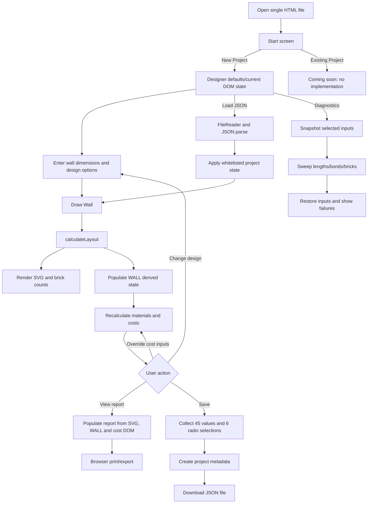
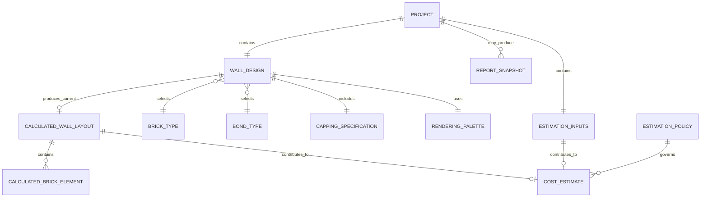

# Brick Wall Designer — 应用与概念数据分析

> 分析对象：`BrickWallDesigner_v18.html`。证据来自 HTML 控件、内嵌 JavaScript、Save/Load JSON、计算与渲染函数。  
> 状态：**Confirmed**＝源代码直接确认；**Inferred**＝有代码证据支持的推断；**Unknown**＝代码无法确认。  
> 本报告止于数据发现和概念建模，不进入逻辑/物理数据库、CMS Schema、API 或实现阶段。

## 1. Application 的主要用途、用户和用户任务

### 1.1 主要用途

Brick Wall Designer 是一个浏览器内运行的单文件砖墙设计与估算工具。它依据墙体尺寸、砖型、砂浆厚度、砌筑方式、切砖及压顶选项，生成双层砖墙 SVG 示意图、实际尺寸、砖数、材料数量、材料及人工成本、GST 和可打印报告；用户输入可以保存为 JSON 文件并重新加载。**Confirmed**：页面 L967-L2144；`calculateLayout` L2948；`drawWall` L5257；`recalculateCosts` L5534；`saveProject` L2771；`loadProject` L2802。

### 1.2 涉及的用户

| 用户/参与者 | 代码能确认的角色 | 状态与依据 |
|---|---|---|
| Browser user | 输入设计与成本参数、绘图、查看报告、保存和加载项目 | **Confirmed**：UI 控件和事件处理器。代码没有登录或身份模型，因此只能称为匿名浏览器用户。 |
| Application calculation engine | 计算布局、砖数、材料量、人工费、材料费和 GST | **Confirmed**：`calculateLayout`、`drawWall`、`recalculateCosts`。 |
| Application maintainer | 通过修改源代码维护砖型、bond labels、默认参数和算法 | **Inferred**：这些数据硬编码且没有管理 UI。 |
| Owner/estimator/design-support user | 可能的实际业务使用者 | **Inferred**：功能与提示语支持此判断，但代码未定义正式用户类型。 |
| Customer/site/project owner | 代码未建模；只在项目命名帮助文本中出现 client/site 示例 | **Unknown**：L2078-L2083。不得认定为已存在业务角色。 |

### 1.3 用户任务

| 用户任务 | 结果 | 依据 |
|---|---|---|
| 新建项目 | 进入 Designer 默认状态 | `NEW PROJECT` L982-L986；仅调用 `showPage(1)`，不会清空已有值 |
| 设置墙体设计 | 输入尺寸、砖型、bond、切砖和压顶选项 | L1022-L1123 |
| 绘制/重算墙体 | 生成 SVG、实际尺寸、砖数和 `WALL` 状态 | `drawWall` L5257-L5502 |
| 调整成本参数 | 用用户值覆盖 RenoPilot 默认值并立即重算 | `u_*` controls；`userOrDefault` L5514-L5520 |
| 查看材料与成本 | 查看基础、钢筋、砖、砂浆、材料费、人工费、GST和总额 | `recalculateCosts` L5534-L5755 |
| 查看/打印报告 | 克隆当前 SVG 和成本摘要，调用浏览器打印 | `populateReport` L2590；`printReport` L2484 |
| 保存项目 | 下载包含元数据与输入状态的 JSON | `saveProject` L2771-L2800 |
| 加载项目 | 读取本地 JSON、恢复白名单输入、重绘和重算 | `loadProject` L2802-L2835；`applyProjectState` L2719-L2744 |
| 执行完整性诊断 | 批量测试墙长、bond、砖型及砂浆组合 | `runWallIntegrityTest` L4827-L4915 |
| 缩放/适配图形 | 改变显示比例，不改变业务设计 | `zoom`、`fitToWindow` L5764-L5775 |

## 2. 工作流程

### 2.1 工作流程表

| 流程 | 触发/UI | 主要函数 | 输入/状态变化 | 持久化行为 | 依据 |
|---|---|---|---|---|---|
| Start / New Project | 启动页按钮 | `showPage(1)` | 显示 Designer；不重置现有 DOM | 无 | L982-L986、L2625-L2650 |
| Configure Design | Designer inputs | getters | 修改 DOM 输入 | Save 时进入 state | L1022-L1123、L2197-L2215 |
| Draw/Recalculate | Draw Wall | `drawWall`→`calculateLayout`→`renderWall`→`recalculateCosts` | 重建 layout、SVG、counts、`WALL`、成本 | 派生值不保存 | L2948、L5257-L5502 |
| Configure Costs | Page 2 `u_*` | `userOrDefault`,`recalculateCosts` | 空值使用默认；0 为有效覆盖 | 34 个 override 原始值保存 | L5514-L5755、L2655-L2701 |
| View Report | nav3 | `showPage(3)`,`populateReport` | 克隆 SVG，读取 `WALL` 和成本 DOM | 无 | L2590-L2646 |
| Print/Export Report | Print buttons | `printReport` | 构造临时 HTML 并调用 browser print | 应用不保存报告对象 | L2484-L2588 |
| Save Project | project name + Save | `collectProjectState`,`saveProject` | 生成 project root 和 state | 下载 JSON Blob | L2704-L2717、L2771-L2800 |
| Load Project | JSON file + Load | `loadProject`,`applyProjectState` | 覆盖白名单值，触发 change，重绘/重算 | 从选定文件读取 | L2719-L2744、L2802-L2835 |
| Diagnostics | diagnostic modal | `runWallIntegrityTest`,`checkLayoutIntegrity` | 暂存部分输入、批量替换测试、恢复 | 不保存 | L4778-L4915 |
| Reset/Delete | 无相应实现 | — | Start 只回到遮罩；没有项目或单砖删除 | 无 | `showStartScreen` L2648-L2650 |

### 2.2 整体流程图



## 3. 所有输入字段和值

说明：按钮不是数据字段。`Persisted` 表示当前 Save JSON 是否保存该值。成本输入的 HTML 初始值为空；计算时通过 `userOrDefault` 使用代码默认，且用户输入 `0` 会覆盖默认值。**Confirmed**：L5514-L5520。

### 3.1 设计输入与隐藏配置

| 字段 | UI 类型 | 值/范围/默认 | 条件或含义 | Persisted | 依据 |
|---|---|---|---|---|---|
| `WL` | number | 100..50000 mm；默认1235 | 输入墙长 | Yes | L1024；`getWallLength` L2205 |
| `WH` | number | 100..10000 mm；默认1750 | 输入墙高 | Yes | L1027；L2206 |
| `MJ` | number | 0..30 mm；默认10 | 0/空/NaN计算时回退10 | Yes | L1030；L2200 |
| `BT` | select | s, l, u, m, r；默认首项s | 砖型代码 | Yes | L1035-L1041；L2150-L2163 |
| `cu` | radio | y/n；默认n | 是否允许切砖 | Yes | L1048-L1050；L2201-L2202 |
| `ad` | radio | s/l；默认s | 禁止切砖时调整为更短/更长 | Yes | L1055-L1058；L2203-L2204 |
| `bond` | radio | stretcher/header/english/englishGardenWall/flemish/flemishGardenWall/common；默认stretcher | 砌筑方式 | Yes | L1063-L1076；L2208-L2209 |
| `cc` | radio | y/n；默认n | 是否包含压顶层 | Yes | L1083-L1085；L2210-L2211 |
| `cco` | radio | flat/vertical/soldier；默认flat | 仅在 cc=y 时生效 | Yes | L1091-L1096；L2214-L2215 |
| `ccoff` | radio | y/n；默认n | 压顶端砖错位；仅 cc=y 生效 | Yes | L1102-L1104；L2212-L2213 |
| `sk_hidden` | hidden | 2 | 页面保存此值，但 `getSkinCount()` 固定返回2 | Yes | L1113；L2207 |
| `C1` | hidden | `#C1440E` | odd stretcher colour | Yes | L1115；`renderWall` L4999-L5007 |
| `C2` | hidden | `#A63A0C` | even stretcher colour | Yes | L1116；L4999-L5007 |
| `C3` | hidden | `#8B6914` | special brick colour | Yes | L1118；L4999-L5007 |
| `C4` | hidden | `#AE0000` | cut/capping-cut colour | Yes | L1119；L4999-L5007 |
| `C5` | hidden | `#D4C8B0` | mortar colour | Yes | L1120；L5008 |
| `C6` | hidden | `#8B3A0C` | header colour | Yes | L1117；L4999-L5007 |
| `CHR` | hidden | `#710000` | capping colour | Yes | L1121；L4998-L5007 |

### 3.2 材料、工程与成本覆盖输入

| 字段 | 业务含义 | 单位 | HTML允许值 | 空值时代码默认 | Persisted | 依据 |
|---|---|---|---|---:|---|---|
| `u_side_clear` | 工作区侧向净距 | mm | ≥0 | 1500 | Yes | L1276；L5552 |
| `u_end_clear` | 工作区端部净距 | mm | ≥0 | 2000 | Yes | L1286；L5553 |
| `u_footing_ext` | 基础外伸量 | mm | ≥0 | 100 | Yes | L1331；L5566 |
| `u_footing_ratio` | 墙高:基础深度比 | N/A | ≥0 | 4 | Yes | L1354；L5573-L5574 |
| `u_mesh_inset` | 钢筋网内缩 | mm | ≥0 | 50 | Yes | L1388；L5583 |
| `u_mesh_layers` | 钢筋网层数 | count | ≥0 | 2 | Yes | L1411；L5591 |
| `u_roadbase_depth` | 路基层深度 | mm | ≥0 | 100 | Yes | L1433；L5594 |
| `u_compact_factor` | 压实比例 | percent | 0..100 | 10 | Yes | L1474；L5602-L5603 |
| `u_steel_len` | 单根钢筋长度 | m | ≥0 | 8 | Yes | L1501；L5611 |
| `u_brick_contingency` | 砖损耗比例 | percent | ≥0 | 10 | Yes | L1538；L5619 |
| `u_mortar_contingency` | 砂浆损耗比例 | percent | ≥0 | 10 | Yes | L1566；L5635 |
| `u_mix_cement` | 砂浆水泥配比份 | count | ≥0 | 1 | Yes | L1583；L5643 |
| `u_mix_lime` | 砂浆石灰配比份 | count | ≥0 | 0 | Yes | L1591；L5644 |
| `u_mix_sand` | 砂浆砂配比份 | count | ≥0 | 4 | Yes | L1599；L5645 |
| `u_cost_rb` | 路基层单价 | currency/m³ | ≥0 | 50 | Yes | L1647；L5667 |
| `u_cost_steel` | 钢筋单价 | currency/length | ≥0 | 18 | Yes | L1655；L5668 |
| `u_cost_conc` | 混凝土单价 | currency/m³ | ≥0 | 400 | Yes | L1665；L5669 |
| `u_cost_brick` | 单砖价格 | currency/brick | ≥0；step .01 | 2.00 | Yes | L1673；L5670 |
| `u_cost_cement` | 水泥单价 | currency/kg | ≥0；step .01 | 0.50 | Yes | L1683；L5671 |
| `u_cost_lime` | 石灰单价 | currency/kg | ≥0；step .01 | 1.10 | Yes | L1691；L5672 |
| `u_cost_sand` | 砂单价 | currency/kg | ≥0；step .01 | 0.10 | Yes | L1699；L5673 |
| `u_allow_site` | 场地通行预留费 | currency | ≥0 | 0 | Yes | L1737；L5701 |
| `u_allow_waste` | 废料处理预留费 | currency | ≥0 | 0 | Yes | L1753；L5702 |
| `u_lab_prepare` | 工作区准备人工费率 | currency/m² | ≥0 | 0 | Yes | L1773；L5703 |
| `u_lab_trench` | 沟槽开挖人工费率 | currency/m³ | ≥0 | 50 | Yes | L1781；L5704 |
| `u_lab_compact` | 路基层压实人工费率 | currency/m² | ≥0 | 20 | Yes | L1789；L5705 |
| `u_lab_pour` | 混凝土浇筑人工费率 | currency/m² | ≥0 | 50 | Yes | L1797；L5706 |
| `u_lab_lay` | 砌砖人工费率 | currency/brick | ≥0；step .01 | 2.00 | Yes | L1805；L5707 |
| `u_min_prepare` | 工作区准备最低费 | currency | ≥0 | 0 | Yes | L1821；L5709 |
| `u_min_trench` | 沟槽开挖最低费 | currency | ≥0 | 500 | Yes | L1834；L5710 |
| `u_min_compact` | 压实最低费 | currency | ≥0 | 0 | Yes | L1844；L5711 |
| `u_min_pour` | 浇筑最低费 | currency | ≥0 | 500 | Yes | L1857；L5712 |
| `u_min_lay` | 砌砖最低费 | currency | ≥0 | 1000 | Yes | L1870；L5713 |

### 3.3 项目文件与诊断输入

| 字段 | 类型 | 值/默认 | Persisted | 依据 |
|---|---|---|---|---|
| `sp_name` | text | 用户输入；Save 时 trim 后必须非空 | Yes，保存为 root `projectName` | L2052-L2065；L2771-L2785 |
| `sp_load_file` | file | `.json,application/json` | No；仅用于导入 | L2117-L2127；L2802-L2835 |
| `DIAG_MIN` | number | 100..49000；默认600 mm | No | L928；L4830 |
| `DIAG_MAX` | number | 200..50000；默认10000 mm | No | L932；L4831 |
| `DIAG_STEP` | number | 0.1..500；step .1；默认1 mm | No | L936；L4832 |
| `DIAG_MORTAR` | number | 0..30；默认17 mm | No | L940；L4833 |
| `DIAG_ALLBONDS` | checkbox | 默认false | No | L945；L4834 |
| `DIAG_ALLBRICKS` | checkbox | 默认false | No | L951；L4835 |
| `DIAG_CUTS_ONLY` | checkbox | 默认true | No | L957；L4836 |

## 4. 数据字典

### 4.1 Save JSON 数据结构

```text
project
├─ appName: "Brick Wall Designer"
├─ appVersion: "v16"
├─ projectName: user text
├─ savedAt: ISO datetime
└─ state
   ├─ values: 45 DOM value strings
   └─ radios: 6 selected radio strings
```

**Confirmed**：`collectProjectState` L2704-L2717；`saveProject` L2771-L2800。数字字段在 JSON 中实际是 string，因为保存读取 DOM `.value`；下表的类型是业务语义类型。

| 数据项/路径 | 业务类型 | 单位 | 必填/默认语义 | 允许值 | Load 行为 | 依据 |
|---|---|---|---|---|---|---|
| `project.appName` | string | N/A | Save 固定写出 | Brick Wall Designer | 不读取/不校验 | L2780、L2812-L2822 |
| `project.appVersion` | string | N/A | Save 固定 v16 | v16（当前） | 不读取/不校验 | L2781 |
| `project.projectName` | string | N/A | Save 前非空；JSON本身未限制长度 | user text | 恢复到 `sp_name` | L2772-L2783、L2814 |
| `project.savedAt` | datetime string | N/A | 浏览器生成 | ISO-8601 | 仅格式化显示 | L2783、L2819-L2821 |
| `state.values.BT` | enum string | N/A | 默认s | s/l/u/m/r | 白名单赋值后查 reference | L2655-L2709、L2721-L2725 |
| `state.values.MJ/WL/WH` | decimal strings | mm | HTML默认；getter有fallback | 第3节范围 | 赋 DOM 后重算 | 同上；L2200-L2206 |
| `state.values.C1..C6/CHR` | colour strings | N/A | 固定隐藏默认 | 未验证 hex string | 赋 DOM 后用于 render | L2660-L2666、L4997-L5008 |
| `state.values.sk_hidden` | integer-like string | count | 默认2 | 实际计算固定2 | DOM恢复但算法忽略非2值 | L2667、L2207 |
| `state.values.u_*`（34项） | decimal/blank strings | 各项见3.2 | blank＝计算时使用代码默认；0＝明确覆盖 | HTML一般≥0 | 恢复后 `recalculateCosts` | L2668-L2700、L5514-L5755 |
| `state.radios.bond` | enum | N/A | 默认stretcher | 7 bond codes | 精确匹配 radio | L2702、L2727-L2739 |
| `state.radios.cu/cc/ccoff` | boolean-like enum | N/A | 默认n | y/n | 精确匹配并触发change | 同上 |
| `state.radios.ad` | enum | N/A | 默认s | s/l | 精确匹配 | 同上 |
| `state.radios.cco` | enum | N/A | 默认flat | flat/vertical/soldier | 精确匹配并更新条件UI | 同上 |

### 4.2 参考数据

| 数据集 | Code | Label/Value | Dimensions/Meaning | 依据 |
|---|---|---|---|---|
| Brick Type | s | Standard | 230×110×76 mm | `BRICK_TYPES`,`BRICK_NAMES` L2150-L2163 |
| Brick Type | l | Slimline | 290×90×47 mm | 同上 |
| Brick Type | u | Utility | 290×90×76 mm | 同上 |
| Brick Type | m | Modular | 190×90×90 mm | 同上 |
| Brick Type | r | Roman | 290×90×40 mm | 同上 |
| Bond Type | stretcher | Stretcher Bond | layout algorithm branch | radios L1063-L1076；`NAMES` L5158-L5166 |
| Bond Type | header | Header Bond | 同上 | 同上 |
| Bond Type | english | English Bond | 同上 | 同上 |
| Bond Type | englishGardenWall | English Garden Wall Bond | 同上 | 同上 |
| Bond Type | flemish | Flemish Bond | 同上 | 同上 |
| Bond Type | flemishGardenWall | Flemish Garden Wall Bond | 同上 | 同上 |
| Bond Type | common | Common Bond (American) | 同上 | 同上 |
| Capping orientation | flat | header on flat | unitW=brick.w；rowH=brick.h | `cappingDimensions` L2230-L2236 |
| Capping orientation | vertical | header on edge | unitW=brick.h；rowH=brick.w | 同上 |
| Capping orientation | soldier | stretcher on end | unitW=brick.h；rowH=brick.l | 同上 |
| Adjustment direction | s/l | Shorter/Longer | 禁止切砖时调整实际长度 | L1055-L1058 |
| Boolean-like flags | y/n | Yes/No | cu、cc、ccoff | 对应 radio/getter |

### 4.3 主要派生数据

| 派生项 | 类型/单位 | 计算来源 | 可重算 | 当前保存 | 依据 |
|---|---|---|---|---|---|
| 实际墙长、高、双层墙宽 | decimal/mm | layout、brick width、mortar | Yes | No | `WALL.length/height/width` L5475-L5478 |
| 各类砖数与总砖数 | integer/count | layout brick categories及单双层倍数 | Yes | No | L5408-L5497 |
| 含损耗订购砖数 | integer/count | `ceil(WALL.total×(1+contingency))` | Yes | No | L5619-L5621 |
| 工作面积、墙投影、基础面积/深度/体积 | decimal/m²/mm/m³ | WALL dimensions及工程覆盖参数 | Yes | No | L5551-L5580 |
| 钢筋网尺寸、钢筋根数 | decimal/integer | footing、inset、layers、bar length | Yes | No | L5582-L5614 |
| 开挖与路基层体积 | decimal/m³ | footing footprint、depth、compaction | Yes | No | L5593-L5608 |
| 砂浆体积和水泥/石灰/砂质量 | decimal/m³/kg | brick geometry、mortar、mix、density | Yes | No | L5623-L5664 |
| 七项材料成本及合计 | decimal/currency | material quantity×unit cost | Yes | No | L5666-L5698 |
| 场地/废料及五项人工成本、合计 | decimal/currency | allowance；max(quantity×rate, minimum) | Yes | No | L5700-L5748 |
| GST component | decimal/currency | grand total / 11 | Yes | No | L5750-L5754 |
| Grand total | decimal/currency | materialsTotal + labourTotal | Yes | No | L5750-L5751 |
| SVG/report | SVG/HTML | layout、WALL、cost DOM | Yes | No（仅交给浏览器打印） | L2484-L2623、L4997-L5144 |

## 5. 概念业务实体识别图

> **候选业务实体不等于最终数据库表。** 图中 Calculated/Estimate/Report 概念是当前派生对象或未来快照候选，不代表已批准持久化。



| 概念实体 | 含义 | 身份/生命周期证据 | 状态 |
|---|---|---|---|
| Project | 命名的 JSON 保存边界 | 无稳定ID；Save创建文件，Load读取文件 | **Confirmed** |
| Wall Design | 墙尺寸和设计选项集合 | 无独立ID；作为 Project state 的组成部分整体修改 | **Confirmed** |
| Estimation Inputs | 34项工程、价格、人工和最低费覆盖 | 无独立ID；随项目保存 | **Confirmed** |
| Brick Type | 砖型代码、名称、尺寸 | 5个硬编码 reference records | **Confirmed** |
| Bond Type | bond代码、label和算法选择 | 7个允许值 | **Confirmed** |
| Capping Specification | include、orientation、offset | 设计内 value-object 候选 | **Confirmed** |
| Rendering Palette | 7个砖/砂浆颜色 | hidden inputs；随项目保存 | **Confirmed** |
| Calculated Wall Layout | 实际尺寸、courses、砖图元和counts | Draw后创建；重算时替换；不保存 | **Confirmed derived** |
| Estimation Policy | 默认工程值、费率、密度、GST规则 | 当前无ID/版本，硬编码 | **Inferred conceptual candidate** |
| Cost Estimate | 材料量、成本、GST、总额 | 每次重算替换；不保存 | **Confirmed derived / entity status Inferred** |
| Report Snapshot | SVG与成本摘要的打印结果 | 当前只即时生成，应用不管理 | **Inferred** |
| User/Customer/Site | 潜在业务主体 | 代码没有数据结构 | **Unknown** |

## 6. 实体关系和基数

| 业务关系 | 基数/可选性 | 所有权/依赖 | 依据与状态 |
|---|---|---|---|
| 一个 Project 包含一个 Wall Design | 当前 1:1、必需 | Wall Design 随 Project state 保存 | Save JSON shape，**Confirmed** |
| 一个 Project 包含一组 Estimation Inputs | 当前 1:1；各 override 可为空 | 随 Project 保存 | `PROJECT_VALUE_IDS`，**Confirmed** |
| Wall Design 选择 Brick Type | 每个 Design 恰好1个；一个类型可被0..多设计选择 | Design引用code | `BT`/`BRICK_TYPES`，**Confirmed** |
| Wall Design 选择 Bond Type | 每个 Design 恰好1个；一个bond可被0..多设计选择 | Design引用code | `bond` radios，**Confirmed** |
| Wall Design 包含 Capping Specification | 1:1；cc=no时orientation/offset保存但不生效 | Design组成部分 | `cc`,`cco`,`ccoff`，**Confirmed** |
| Wall Design 使用 Rendering Palette | 当前1:1 | Design/Project组成部分 | hidden colours in saved state，**Confirmed** |
| Wall Design 产生 Calculated Wall Layout | 0..1个当前layout；未Draw时0 | 派生并随重算替换 | `lastLayout`,`WALL.ready`，**Confirmed** |
| Calculated Layout 包含 Calculated Brick Elements | 0..多 | 纯派生，不能独立维护 | `wallBricks`,`ccBricks`，**Confirmed** |
| Layout + Estimation Inputs 产生 Cost Estimate | 未Draw为0；有效layout时1个当前结果 | 依赖两类输入及默认规则 | `recalculateCosts`，**Confirmed** |
| Estimation Policy 支配 Cost Estimate | 当前代码逻辑上一个默认规则集作用于所有估算 | 无独立持久对象 | hard-coded defaults，**Inferred** |
| Project 与历史版本/报告快照 | 当前不支持；未来基数未知 | Unknown | 无持久历史证据，**Unknown** |
| Project 与 User/Customer/Site | Unknown | Unknown | 代码未建模，**Unknown** |

## 7. 数据库设计视角的应用理解与报告

### 7.1 当前数据边界与 Source of Truth

| 观察 | 数据库设计含义（概念层） | 依据 |
|---|---|---|
| 当前 Project JSON 是唯一显式持久化边界 | 用户不可重建的数据是项目元数据、设计输入、颜色及34项估算覆盖 | `saveProject`、`collectProjectState` |
| 活跃 DOM 是编辑期间的当前状态 | JSON是离线快照，不是受管理的共享记录；多个文件副本可能分叉 | collect/apply直接读写 DOM |
| Brick/Bond/defaults 在源码中 | reference/configuration 与项目数据有不同所有权和更新节奏 | `BRICK_TYPES`,`NAMES`,`userOrDefault` literals |
| Layout、counts、materials、costs均可重算 | 当前无需作为核心持久输入；若要求历史可重现，是否保存快照需业务决定 | `drawWall`,`recalculateCosts`；Save不包含这些对象 |
| appVersion写出但不读取 | 当前文件没有真正的 schema/version compatibility control | L2781；Load L2812-L2822 |

### 7.2 已确认的持久化需求

- 项目名称、保存时间和完整设计输入需要跨会话恢复。**Confirmed**：Save/Load UI及实现。
- 45个 `state.values` 和6个 `state.radios` 是当前实际保存范围。**Confirmed**：L2655-L2717。
- 空成本覆盖值必须与数值0区分：空使用代码默认，0覆盖默认。**Confirmed**：`userOrDefault` L5514-L5520。
- Brick Type、Bond Type及Capping枚举必须保持代码值稳定，否则旧JSON无法正确恢复。**Inferred requirement**，依据 Load 的精确值匹配且无迁移。
- 派生值是否需要历史快照不能由当前代码确认。**Unknown**。

### 7.3 数据质量和建模风险

| 风险 | 事实依据 | 状态 |
|---|---|---|
| 版本不一致 | 文件名v18、title/start/save v16、provenance v15 | **Confirmed / High** |
| 数字以string保存 | `collectProjectState`读取 `.value` | **Confirmed / High** |
| 导入无schema/type/range/version校验 | `JSON.parse`后直接`applyProjectState(project.state)` | **Confirmed / High** |
| 空、0、缺失语义不同 | blank→default；0有效；Load缺key保留当前UI | **Confirmed / High** |
| Reference重复定义 | brick在select/BRICK_TYPES/BRICK_NAMES；bond在radio/array/NAMES | **Confirmed / High** |
| 默认显示和计算分散 | UI文案和JS literal分别维护 | **Confirmed / High** |
| 单位混合 | mm、m、m²、m³、kg、count、$ | **Confirmed / High** |
| 币种/地域/有效期缺失 | 只显示 `$` 和 GST 文案 | **Confirmed gap / High** |
| 导入可能产生孤立reference | 未知BT/bond值未验证 | **Confirmed risk / High** |
| 派生结果漂移 | 旧文件只存输入，新版本代码/default会重新计算 | **Confirmed mechanism / High inferred consequence** |
| `sk_hidden`保存但不控制计算 | getter固定2 | **Confirmed / Medium** |
| 项目无稳定ID、owner或审计 | JSON只有name/time/app metadata/state | **Confirmed gap；需求Unknown** |

### 7.4 数据管理类别与报价行为分析

#### 7.4.1 三类数据

| 类别 | 数据 | 当前行为与证据 | 结论 |
|---|---|---|---|
| 必须集中管理、变化较少 | Brick Type code/name/dimensions | 重复硬编码于 HTML options、`BRICK_TYPES`、`BRICK_NAMES`（L1035-L1041、L2150-L2163） | 当前未集中管理，**Confirmed** |
| 必须集中管理、变化较少 | Bond Type code/label/allowed values | 分散于 radios、`ALL_BOND_VALUES`、`NAMES`及算法（L1063-L1076、L4752-L4760、L5158-L5166） | 当前未集中管理，**Confirmed** |
| 必须集中管理、变化较少 | 工程默认值、密度、配比、GST规则 | 以 `userOrDefault` 参数或JS literal硬编码（L5552-L5664、L5752） | 由代码发布控制；变化频率/维护者 **Unknown** |
| 必须集中管理、变化频率未知 | 默认价格、人工费率、最低收费、allowances | 一套 RenoPilot defaults 硬编码于页面与计算函数（L1215-L1217、L5667-L5713） | 无中央价格源、版本、生效日期或审批信息，**Confirmed** |
| 用户频繁编辑 | `WL`,`WH`,`MJ`,`BT`,`bond`,`cu`,`ad`,`cc`,`cco`,`ccoff` | 浏览器用户修改，Draw后重算（L1022-L1123、L5257） | 可编辑行为 **Confirmed**；实际频率无统计，**Unknown** |
| 用户频繁编辑 | 34个 `u_*` 工程、价格、费率、损耗、最低费覆盖 | 用户输入、`oninput`重算、Save保存（L1276-L1870、L2655-L2701） | **Confirmed** |
| 用户频繁编辑 | `projectName` | 用户输入/应用建议，保存到JSON root（L2052-L2087、L2753-L2785） | **Confirmed** |
| 正式、不能变化的结果 | accepted quote、批准时间/人、状态、锁定单价/总额 | 这些字段和对象不存在；Save仅保存输入（L2779-L2785） | 当前没有正式不可变结果，**Confirmed absence** |
| 正式、不能变化的结果 | 当前estimate/打印报告 | 派生金额不保存；免责声明称其不是formal quote、contract或guarantee（L2009-L2010、L2484-L2550） | 当前结果可重算且非正式报价，**Confirmed** |

当前代码可确认 reference/configuration 与项目编辑数据性质不同，但两者仍处于单文件代码和本地JSON模式中。代码没有已接受、已批准或锁定的正式报价。未来不可变结果的内容和锁定时点必须由业务确认。**Unknown**。

#### 7.4.2 价格调整后，旧设计使用现价还是保留当时价格？

| 检查点 | Application证据结论 | 依据 |
|---|---|---|
| 是否保存默认价格实际取值？ | **No**。`u_cost_*`空白时JSON保存空字符串；实际default和派生总额不保存 | `collectProjectState` L2704-L2709；L2668-L2674 |
| 空价格旧项目加载后如何计算？ | Load恢复空字符串并重算；`userOrDefault`使用当前代码default | L2719-L2744、L5514-L5520、L5667-L5673，**Confirmed** |
| 默认价格后来改变会怎样？ | 原空白价格会采用新代码default，派生总额可能变化 | 上述调用链，**Confirmed technical behaviour** |
| 显式输入价格（包括0）会怎样？ | 输入随JSON保存/恢复，重算使用该项目覆盖值 | L1215-L1217、L2668-L2674、L2704-L2744，**Confirmed** |
| 能否表达“2026年1月已接受报价不能变化”？ | **No**。无accepted/approved/locked、acceptedAt、price version或不可变结果；免责声明称estimate不是formal quote | L2009-L2010、L2549、L2779-L2785，**Confirmed absence** |
| 业务上应使用现价还是原价？ | **Unknown**。代码证明当前重算行为，但不定义报价政策 | 需产品、财务/估算、法务确认 |

**结论：** 当前技术行为是“空白价格跟随打开项目时的代码default；显式用户价格随项目保存”。这不等同于正式报价政策。已接受报价是否冻结，application中没有答案，不能推测。

#### 7.4.3 价格来自供应商报价还是统一源表？谁能修改？

| 检查点 | Application证据结论 | 依据 |
|---|---|---|
| 是否有Supplier/Vendor或supplier quote数据？ | **No**。无supplier/vendor ID、name、product quote、selection或关系对象 | HTML/JS静态检索，**Confirmed absence** |
| 是否调用供应商或中央价格源？ | **No**。无fetch/XHR/API、外部价格JSON/CSV或数据库调用 | 外部依赖检查，**Confirmed absence** |
| 是否有统一报价源表？ | **No**。只有一套硬编码 RenoPilot defaults | L1215-L1217、L5667-L5713，**Confirmed** |
| Disclaimer提到supplier是否证明逐供应商定价？ | **No**。只说明实际价格会因supplier等因素变化，未说明默认价格来源 | L2009、L2549，**Confirmed text / sourcing Unknown** |
| 项目价格能否修改？ | **Yes**。任何能操作HTML的浏览器用户可改 `u_cost_*`、`u_lab_*`、allowance、minimum，立即重算并保存 | L1647-L1870、`PROJECT_VALUE_IDS`，**Confirmed** |
| 谁能修改项目级价格？ | 只能确认匿名浏览器用户；无身份、角色或权限检查 | 可编辑UI且无认证代码，**Confirmed** |
| 谁能修改默认价格？ | 技术路径是修改HTML/JS literals并重新分发；责任人/审批流程 **Unknown** | L5667-L5713 |
| 应采用多供应商还是统一价格源？ | **Unknown**。当前既无供应商模型，也无受管理统一源表 | 来源、产品、有效期、审批数据缺失 |
| 正式报价后谁可修改？ | **Unknown**。无客户身份、报价对象、状态、锁定或权限模型 | L2009-L2010及Save JSON结构 |

**结论：** 当前实现是“一套应用内默认价格 + 每项目由匿名浏览器用户覆盖”，不能认定为多供应商报价模型或中央统一价格主表。价格来源和正式报价修改权限必须人工确认。

### 7.5 下一阶段前必须确认的问题

| Question | 影响 | 依据状态 |
|---|---|---|
| 权威应用与保存格式版本是v18、v16还是其他？ | 兼容与计算可追溯性 | **Unknown**；三处标识冲突 |
| 一个Project是否永远只有一面墙？ | 概念关系和聚合边界 | **Unknown**；当前JSON仅支持一个 |
| 是否需要用户、客户、场地、组织和权限？ | 所有权、查询和访问范围 | **Unknown**；代码无此数据 |
| `$`的币种、地区与GST适用规则是什么？ | 所有金额字段语义 | **Unknown** |
| 默认价格、密度、工程参数的来源、审批人和有效期？ | 配置可信度及版本 | **Unknown** |
| 旧项目是否必须复现保存时的原始材料量和成本？ | 是否需要算法/config版本或结果快照 | **Unknown** |
| Project/Estimate/Report是否需要历史、归档、删除和审计？ | 持久化范围 | **Unknown** |
| 非法或旧版JSON应拒绝、修复还是警告？ | 导入完整性规则 | **Unknown** |
| `currency/length`中的钢筋length准确业务单位是什么？ | 单价定义 | **Unknown** |
| 实际项目数量、并发、共享和批量需求？ | 后续容量与访问设计 | **Unknown** |

### 7.6 范围结论

当前应用是“单个命名项目文件 + 一个墙体设计状态 + 一组成本覆盖 + 源码内reference/config + 可重算输出”的本地浏览器模型。此结论由 Save JSON、输入白名单及计算路径直接支持。用户、客户、场地、审批、历史版本、共享协作和集中式项目库均未在代码中实现，不能作为已确认需求。

**本报告在概念数据发现阶段停止。未经明确批准，不进入逻辑数据库设计、物理数据库设计、CMS Schema、API 或实现阶段。**
