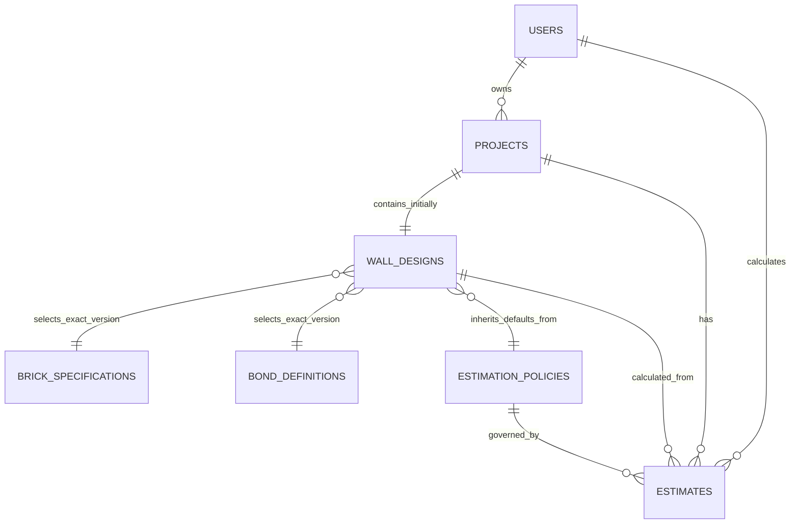

# 05 Payload 数据库设计

> 应用：Brick Wall Designer / RenoPilot application template  
> 目标平台：Payload CMS 3，使用关系型数据库适配器  
> 文档状态：供评审的建议设计；本文档不授权实施  
> 来源文档：`01_Application_Discovery_Report.md`、`02_Data_Discovery_and_Conceptual_Model_Report.md` 和 `03_Data_Field_Dictionary.md`

## 1. 目的与设计定位

本文档把已确认的应用输入和概念模型，转换为一套适用于 Payload CMS 的逻辑与物理数据库设计建议。此设计有意采用比旧版“保存/加载 JSON”格式更结构化的方式。

当前应用属于以计算为核心的系统，而不是以内容发布为主的 CMS。它的持久化聚合根是一个命名项目，其中包含一个墙体设计和一组估算覆盖值。砖块尺寸、砌筑方式选项、工程默认值、费率和税务规则属于共享的参考/配置数据。几何数据、SVG、工程量和成本由计算引擎派生。

建议模型的目标是：

- 使用有类型、有验证的持久化数据，替代以 HTML 元素 ID 为键的映射；
- 提供稳定的项目标识、所有权、搜索、归档和版本历史；
- 通过记录准确的参考数据版本和政策版本，实现可复现计算；
- 清晰区分原始输入、继承的默认值、明确覆盖值和派生输出；
- 防止孤立引用和不安全删除；
- 为当前 JSON 文件格式提供迁移路径；
- 保持 Payload Admin 对估算人员的实用性。

## 2. 证据、假设与设计决策

### 2.1 本设计采用的已确认事实

- 当前每个已保存项目正好包含一个墙体设计。
- 每个墙体设计选择一种砖型和一种砌筑方式。
- 墙体目前固定为双层墙体。
- 压顶设置和渲染配色属于墙体设计。
- 实际存在 33 个可选的 `u_*` 估算覆盖字段。它们与 4 个主要输入、7 个配色值以及已保存的墙体层数字段一起，组成已确认的 45 个 Save value 字段。发现报告中“34”的表述属于源文档计数不一致；字段字典实际列出了 33 个 `u_*` 字段。
- 空白覆盖值表示“使用已配置的默认值”；零表示明确覆盖为零。
- 墙体几何、SVG 元素、材料用量和成本总额均可重新计算，目前不持久化。
- 当前运行时没有用户所有权、项目列表、受管理的历史记录或数据库。
- 当前 Payload 应用使用 SQLite，并且已有 `users`、`media` 和 `pages` Collections。

### 2.2 需要业务确认的设计假设

| 假设 | 建议基线 | 如果不接受该假设的影响 |
|---|---|---|
| 每个项目的墙体数量 | 每个项目一个墙体设计 | 如果一个项目需要多面墙，应移除 `wall-designs.project` 的唯一约束，并增加墙体序号/名称。 |
| 用户模型 | 每个项目有一个所有者 | 如果生产环境需要共享项目，应先增加组织/团队成员模型。 |
| 地区和货币 | 由政策定义；初始种子为 AU/AUD | 没有关联政策货币时，不解释任何金额的业务含义。 |
| GST | 由政策定义，不在代码中固定为 `/11` | 这样可支持其他税务地区或税率。 |
| 可复现性 | 已接受的估算必须可以复现 | 必须保留准确的输入、参考数据、政策和引擎快照。 |
| 参考数据变更 | 已发布的参考版本不可变 | 修正时创建新版本，而不是重写历史数据。 |
| 项目生命周期 | 初始仅使用 `active` 和 `archived` | 后续可增加审批/报价流程，且不与 Payload 发布状态混淆。 |

### 2.3 重要建模决策

1. **项目元数据和墙体设计采用不同 Collections。** 这样可将所有权、搜索和归档与计算输入分离，也便于未来受控迁移到一个项目多面墙。
2. **墙体设计是可编辑的计算聚合。** 输入字段、配色、压顶数据和估算覆盖值作为同一文档一起版本化，避免产生不完整的历史版本。
3. **参考记录是版本化业务记录。** 设计关联到准确的砖型规格、砌筑方式定义和估算政策版本，而不是关联一个可变的代码记录。
4. **覆盖值使用明确的可空字段，而不是无类型的键值 JSON。** `NULL` 表示继承政策；`0` 仍表示明确覆盖为零。
5. **不持久化计算生成的几何数据。** 单个生成砖块和 SVG 坐标没有独立业务身份，持久化会造成不必要的数据量和结果漂移。
6. **估算快照可选但不可变。** 仅在用户明确保存/定稿计算结果时创建，不在每次重绘时创建。
7. **操作性项目状态不使用 Payload drafts。** 项目和设计需要版本历史，但它们不是可发布内容。应使用 Payload `versions: true`，业务生命周期字段另行定义。

## 3. 建议的 Collection 模型

### 3.1 核心 Collections

| Payload Collection | 用途 | 生命周期 | 预计数据量 |
|---|---|---|---|
| `users` | 身份验证、角色和项目所有权 | 可变账户 | 低 |
| `projects` | 命名聚合根、所有者、导入来源、归档状态 | 可变、版本化元数据 | 每个已保存项目一条 |
| `wall-designs` | 强类型墙体输入和估算覆盖值 | 可变、版本化 | 初始每个项目一条 |
| `brick-specifications` | 支持砖型的不可变尺寸版本 | 新增版本、停用旧版本 | 很低 |
| `bond-definitions` | 砌筑方式选项和引擎规则标识的不可变版本 | 新增版本、停用旧版本 | 很低 |
| `estimation-policies` | 版本化默认值、费率、密度、货币、税务和工程参数 | 外部起草，启用后冻结 | 低 |
| `estimates` | 不可变计算/结果快照 | 仅追加 | 每个项目零到多条 |

现有的 `pages`、`media` 和 `header` 内容应与计算领域保持分离。它们不应成为项目或估算数据的所有者。

### 3.2 关系模型

基数规则：

- `projects.owner` 必填。
- 基线设计中，`wall-designs.project` 必填且唯一。
- 墙体设计必须关联一个有效的、或历史上有效的砖型规格、砌筑方式定义和估算政策。
- 项目可以在产生有效计算结果之前存在，因此可以没有估算记录。
- 估算既关联当前来源记录，也保存不可变快照，因此以后停用参考记录不会使历史估算失效。

## 4. Collection 规格

### 4.1 `users`

应扩展现有身份验证 Collection，而不是替换它。

| 字段 | Payload 类型 | 必填 | 规则与用途 |
|---|---|---:|---|
| `id` | Payload ID | 是 | 内部主键。 |
| `email` | Auth email | 是 | 唯一；由 Payload auth 提供。 |
| `name` | `text` | 是 | 用户可读名称。 |
| `roles` | `select`、`hasMany` | 是 | 初始值：`admin`、`estimator`、`viewer`；默认 `viewer`；保存到 JWT。 |
| `isActive` | `checkbox` | 是 | 默认 true；停用用户不能创建或修改领域数据。 |
| `createdAt`、`updatedAt` | Payload timestamps | 是 | 系统维护。 |

只有管理员可以更改 `roles` 或 `isActive`。用户可以读取和更新自己的非安全性个人资料字段。

### 4.2 `projects`

`projects` 是用于列表、所有权、导航、归档和旧版导入来源追踪的聚合根。

| 字段 | Payload 类型 | 必填 | 索引 | 规则与用途 |
|---|---|---:|---:|---|
| `id` | Payload ID | 是 | PK | 内部主键。 |
| `projectCode` | `text` | 是 | 唯一 | 稳定的公开/业务标识；由服务端生成，不能只根据名称生成。 |
| `name` | `text` | 是 | 是 | 去除首尾空格，1–160 个字符；不要求全局唯一。 |
| `owner` | `relationship` → `users` | 是 | 是 | 行级安全边界；创建时从已认证用户设置。 |
| `lifecycle` | `select` | 是 | 是 | `active` 或 `archived`；默认 `active`。这是业务状态，不是 Payload `_status`。 |
| `description` | `textarea` | 否 | 否 | 可选项目备注；旧格式不存在。 |
| `schemaVersion` | `number`（整数） | 是 | 否 | 数据库/领域表示版本，从 `1` 开始。 |
| `source` | `group` | 是 | 否 | 以下导入来源字段。 |
| `createdAt`、`updatedAt` | Payload timestamps | 是 | 是 | 服务端控制的时间戳。 |

`source` group：

| 字段 | 类型 | 必填 | 含义 |
|---|---|---:|---|
| `kind` | `select` | 是 | `native` 或 `legacy-json`；默认 `native`。 |
| `applicationName` | `text` | 否 | 旧版 `appName`。 |
| `applicationVersion` | `text` | 否 | 保留传入版本，但不将其视为权威版本。 |
| `formatVersion` | `number` 整数 | 否 | 已验证的导入格式版本；无版本旧文件映射为 `0`。 |
| `legacySavedAt` | `date` | 否 | 导入文件中的浏览器时间；绝不替换服务端时间。 |
| `legacyFilename` | `text` | 否 | 原始文件名，用于追踪。 |
| `importedAt` | `date` | 否 | 服务端导入时间。 |
| `importWarnings` | `array` of `text` | 否 | 导入过程中执行的非致命修复/默认决策。 |

Payload 配置意图：

- 使用 `versions: { maxPerDoc: 100 }`，不启用 drafts；
- 默认排序为 `-updatedAt`；
- `projectCode` 和 `name` 可用于列表搜索；
- 普通用户不能硬删除，应使用归档。

### 4.3 `wall-designs`

此 Collection 包含所有影响墙体布局、渲染或估算的可编辑值。字段必须在一个事务中保存，并作为一个文档整体版本化。

#### 标识与参考字段

| 字段 | Payload 类型 | 必填 | 索引 | 规则 |
|---|---|---:|---:|---|
| `id` | Payload ID | 是 | PK | 内部主键。 |
| `project` | `relationship` → `projects` | 是 | 唯一 | 强制当前一个项目一面墙的基线。 |
| `name` | `text` | 是 | 否 | 默认 `Primary Wall`；支持未来多墙迁移。 |
| `brickSpecification` | `relationship` → `brick-specifications` | 是 | 是 | 准确的不可变尺寸记录。 |
| `bondDefinition` | `relationship` → `bond-definitions` | 是 | 是 | 准确的砌筑方式/引擎规则版本。 |
| `estimationPolicy` | `relationship` → `estimation-policies` | 是 | 是 | 提供全部非覆盖值的政策。 |
| `calculationEngineVersion` | `text` | 是 | 是 | 规范化引擎发布标识，与文件名/UI 标签无关。 |
| `createdAt`、`updatedAt` | Payload timestamps | 是 | 是 | 系统维护。 |

#### 墙体输入字段

| 字段路径 | Payload 类型 | 必填 | 验证/语义 |
|---|---|---:|---|
| `geometry.enteredLengthMm` | `number` 整数 | 是 | 100–50,000 mm；拒绝零和空白，不再静默使用默认值。 |
| `geometry.enteredHeightMm` | `number` 整数 | 是 | 100–10,000 mm。 |
| `geometry.mortarJointMm` | `number` | 是 | 大于 0 且不超过 30 mm；默认 10。 |
| `geometry.skinCount` | `number` 整数 | 是 | schema version 1 中必须为 2；服务端控制。 |
| `cutting.cutBricksAllowed` | `checkbox` | 是 | 对应旧版 `cu`；默认 false。 |
| `cutting.noCutLengthAdjustment` | `select` | 是 | `shorter` 或 `longer`；允许切砖时仍保留，但仅在不允许切砖时生效。 |
| `capping.included` | `checkbox` | 是 | 对应旧版 `cc`；默认 false。 |
| `capping.orientation` | `select` | 是 | `flat`、`vertical` 或 `soldier`。 |
| `capping.endOffset` | `checkbox` | 是 | 对应旧版 `ccoff`；仅在包含压顶时生效。 |

Admin UI 可以按条件隐藏不生效的压顶/调整字段，但无论字段是否可见，服务端都必须验证其允许值。

#### 渲染配色

配色作为 `wall-designs` 中一个有名称的 `group`，因为它影响展示，同时也是项目保存/恢复状态的一部分。

| 旧版键 | 字段 | 类型 | 默认值 |
|---|---|---|---|
| `C1` | `palette.oddStretcher` | 十六进制 `text` | `#C1440E` |
| `C2` | `palette.evenStretcher` | 十六进制 `text` | `#A63A0C` |
| `C6` | `palette.headerBrick` | 十六进制 `text` | `#8B3A0C` |
| `C3` | `palette.specialBrick` | 十六进制 `text` | `#8B6914` |
| `C4` | `palette.cutBrick` | 十六进制 `text` | `#AE0000` |
| `C5` | `palette.mortar` | 十六进制 `text` | `#D4C8B0` |
| `CHR` | `palette.cappingBrick` | 十六进制 `text` | `#710000` |

所有配色值必须匹配 `^#[0-9A-Fa-f]{6}$`。

#### 估算覆盖字段

以下字段都是可空的 `number`。`NULL` 表示从 `estimationPolicy` 继承准确值；零表示明确覆盖为零。API 不得使用 JavaScript 真值判断把零转换为 null 或应用默认值。

| 旧版键 | 建议字段路径 | 单位 | 验证 |
|---|---|---|---|
| `u_side_clear` | `overrides.site.sideClearanceMm` | mm | ≥ 0 |
| `u_end_clear` | `overrides.site.endClearanceMm` | mm | ≥ 0 |
| `u_footing_ext` | `overrides.foundation.footingExtensionMm` | mm | ≥ 0 |
| `u_footing_ratio` | `overrides.foundation.wallHeightToFootingDepthRatio` | 比率 | > 0 |
| `u_mesh_inset` | `overrides.foundation.meshInsetMm` | mm | ≥ 0 |
| `u_mesh_layers` | `overrides.foundation.meshLayerCount` | 数量 | 整数且 ≥ 0 |
| `u_roadbase_depth` | `overrides.foundation.roadBaseDepthMm` | mm | ≥ 0 |
| `u_compact_factor` | `overrides.foundation.compactionPercent` | 百分比 | 0 ≤ 值 < 100 |
| `u_steel_len` | `overrides.foundation.steelBarLengthM` | m | > 0 |
| `u_brick_contingency` | `overrides.materials.brickContingencyPercent` | 百分比 | ≥ 0；业务最大值待确认 |
| `u_mortar_contingency` | `overrides.materials.mortarContingencyPercent` | 百分比 | ≥ 0；业务最大值待确认 |
| `u_mix_cement` | `overrides.materials.mortarCementPart` | 份数 | ≥ 0 |
| `u_mix_lime` | `overrides.materials.mortarLimePart` | 份数 | ≥ 0 |
| `u_mix_sand` | `overrides.materials.mortarSandPart` | 份数 | ≥ 0；有效估算中三项配比总和不能为零 |
| `u_cost_rb` | `overrides.materialRates.roadBase` | 货币/m³ | ≥ 0 |
| `u_cost_steel` | `overrides.materialRates.steelBar` | 货币/每根标准长度 | ≥ 0 |
| `u_cost_conc` | `overrides.materialRates.concrete` | 货币/m³ | ≥ 0 |
| `u_cost_brick` | `overrides.materialRates.brick` | 货币/块 | ≥ 0 |
| `u_cost_cement` | `overrides.materialRates.cement` | 货币/kg | ≥ 0 |
| `u_cost_lime` | `overrides.materialRates.lime` | 货币/kg | ≥ 0 |
| `u_cost_sand` | `overrides.materialRates.sand` | 货币/kg | ≥ 0 |
| `u_allow_site` | `overrides.allowances.siteAccess` | 货币 | ≥ 0 |
| `u_allow_waste` | `overrides.allowances.wasteDisposal` | 货币 | ≥ 0 |
| `u_lab_prepare` | `overrides.labourRates.preparation` | 货币/m² | ≥ 0 |
| `u_lab_trench` | `overrides.labourRates.trenchExcavation` | 货币/m³ | ≥ 0 |
| `u_lab_compact` | `overrides.labourRates.roadBaseCompaction` | 货币/m² | ≥ 0 |
| `u_lab_pour` | `overrides.labourRates.concretePour` | 货币/m² | ≥ 0；单位待业务确认 |
| `u_lab_lay` | `overrides.labourRates.bricklaying` | 货币/块 | ≥ 0 |
| `u_min_prepare` | `overrides.minimumCharges.preparation` | 货币 | ≥ 0 |
| `u_min_trench` | `overrides.minimumCharges.trenchExcavation` | 货币 | ≥ 0 |
| `u_min_compact` | `overrides.minimumCharges.roadBaseCompaction` | 货币 | ≥ 0 |
| `u_min_pour` | `overrides.minimumCharges.concretePour` | 货币 | ≥ 0 |
| `u_min_lay` | `overrides.minimumCharges.bricklaying` | 货币 | ≥ 0 |

Payload 配置意图：

- 使用 `versions: { maxPerDoc: 100 }`，不启用 drafts；
- 更新和删除权限从关联项目的所有者继承；
- 通过一次服务端验证解析政策默认值，并检查全部跨字段约束；
- API 将已解析的有效输入与数据库中保存的覆盖值分开返回；
- 不在此处存储单个计算砖块、SVG、缩放、当前页面、弹窗状态或诊断数据。

### 4.4 `brick-specifications`

砖块尺寸直接影响几何和成本。已被设计或估算引用的记录不得原地修改。

| 字段 | Payload 类型 | 必填 | 索引 | 规则 |
|---|---|---:|---:|---|
| `key` | `text` | 是 | 唯一 | 稳定复合键，例如 `s@1`。 |
| `code` | `text` | 是 | 是 | 业务代码：`s`、`l`、`u`、`m`、`r`；跨版本不唯一。 |
| `specificationVersion` | `number` 整数 | 是 | 是 | 每个 code 从 1 开始。 |
| `name` | `text` | 是 | 是 | 用户可读标签。 |
| `lengthMm` | `number` 整数 | 是 | 否 | > 0。 |
| `widthMm` | `number` 整数 | 是 | 否 | > 0。 |
| `heightMm` | `number` 整数 | 是 | 否 | > 0。 |
| `isCurrent` | `checkbox` | 是 | 是 | 每个 code 只能有一条当前记录。 |
| `effectiveFrom`、`effectiveTo` | `date` | 否 | 是 | 可选治理日期。 |
| `sourceReference` | `text` | 否 | 否 | 规格来源/标准。 |
| `retiredAt` | `date` | 否 | 否 | 停用记录仍可读取和引用。 |

版本 1 应种入以下五条已确认记录：

| Key | Code | 名称 | 长 × 宽 × 高（mm） |
|---|---|---|---|
| `s@1` | `s` | Standard | 230 × 110 × 76 |
| `l@1` | `l` | Slimline | 290 × 90 × 47 |
| `u@1` | `u` | Utility | 290 × 90 × 76 |
| `m@1` | `m` | Modular | 190 × 90 × 90 |
| `r@1` | `r` | Roman | 290 × 90 × 40 |

### 4.5 `bond-definitions`

砌筑方式记录用于标识计算策略；数据库记录不包含可执行公式。

| 字段 | Payload 类型 | 必填 | 索引 | 规则 |
|---|---|---:|---:|---|
| `key` | `text` | 是 | 唯一 | 复合键，例如 `stretcher@1`。 |
| `code` | `text` | 是 | 是 | 稳定外部代码。 |
| `definitionVersion` | `number` 整数 | 是 | 是 | 每个 code 从 1 开始。 |
| `label` | `text` | 是 | 是 | Admin/用户显示标签。 |
| `engineRule` | `select` 或受约束 `text` | 是 | 是 | 映射到已知计算引擎策略。 |
| `isCurrent` | `checkbox` | 是 | 是 | 每个 code 只能有一个当前定义。 |
| `effectiveFrom`、`effectiveTo`、`retiredAt` | `date` | 否 | 是 | 治理日期。 |
| `notes` | `textarea` | 否 | 否 | 不可执行的说明。 |

版本 1 code 为 `stretcher`、`header`、`english`、`englishGardenWall`、`flemish`、`flemishGardenWall` 和 `common`。

### 4.6 `estimation-policies`

估算政策是计算成本所需的一套完整、版本化默认值。政策一旦启用或被估算引用，即变为不可变。

| 字段 | Payload 类型 | 必填 | 索引 | 规则 |
|---|---|---:|---:|---|
| `key` | `text` | 是 | 唯一 | 示例 `AU-AUD-2026-01@1`。 |
| `name` | `text` | 是 | 是 | 用户可读政策名称。 |
| `policyVersion` | `number` 整数 | 是 | 是 | 同一政策系列内单调递增。 |
| `lifecycle` | `select` | 是 | 是 | `draft`、`active`、`retired`；业务配置状态。 |
| `regionCode` | `text` | 是 | 是 | ISO 风格业务地区，初始 `AU`。 |
| `currencyCode` | `text` | 是 | 是 | ISO 4217，初始 `AUD`。 |
| `tax.name` | `text` | 是 | 否 | 初始 `GST`。 |
| `tax.ratePercent` | `number` | 是 | 否 | 初始 10，范围 0–100。 |
| `tax.pricesIncludeTax` | `checkbox` | 是 | 否 | 定义税额是从总价中提取还是另行加上。 |
| `effectiveFrom`、`effectiveTo` | `date` | 是/否 | 是 | 同一政策系列的有效期间不得重叠。 |
| `approvedBy` | `relationship` → `users` | 否 | 否 | 生产治理中，启用前必须填写。 |
| `approvedAt` | `date` | 否 | 否 | 启用审核时间。 |
| `sourceReference` | `textarea` | 否 | 否 | 工程/费率来源。 |

政策包含与 `wall-designs.overrides` 相同的命名 groups，但每个计算字段均不可为空。初始已确认默认值为：

| Group | 默认值 |
|---|---|
| `site` | 侧面净空 1500 mm；端部净空 2000 mm |
| `foundation` | 基础延伸 100 mm；高度/深度比 4；网片内缩 50 mm；2 层；路基深度 100 mm；压实率 10%；钢筋长度 8 m |
| `materials` | 砖损耗 10%；砂浆损耗 10%；水泥:石灰:砂 = 1:0:4 |
| `densities` | 水泥 1440 kg/m³；石灰 500 kg/m³；砂 1600 kg/m³ |
| `materialRates` | 路基 50/m³；钢筋 18/标准长度；混凝土 400/m³；砖 2/块；水泥 0.5/kg；石灰 1.1/kg；砂 0.1/kg |
| `allowances` | 场地通行 0；废弃物处理 0 |
| `labourRates` | 准备 0/m²；开挖 50/m³；压实 20/m²；混凝土浇筑 50/m²；砌砖 2/块 |
| `minimumCharges` | 准备 0；开挖 500；压实 0；混凝土浇筑 500；砌砖 1000 |

计算引擎应使用政策税率推导含税税额，例如 `gross × rate / (100 + rate)`，而不是把旧版 `/11` 规则作为仅存在于代码中的知识。

### 4.7 `estimates`

`estimates` 用于保存用户明确创建的、不可变的报价/历史/可复现性快照。预览计算保持临时状态。

| 字段 | Payload 类型 | 必填 | 索引 | 规则 |
|---|---|---:|---:|---|
| `estimateNumber` | `text` | 是 | 唯一 | 稳定业务标识。 |
| `project` | `relationship` → `projects` | 是 | 是 | 所有权和导航父级。 |
| `wallDesign` | `relationship` → `wall-designs` | 是 | 是 | 当前来源文档引用。 |
| `createdBy` | `relationship` → `users` | 是 | 是 | 已认证操作人。 |
| `calculatedAt` | `date` | 是 | 是 | 服务端时间。 |
| `calculationEngineVersion` | `text` | 是 | 是 | 准确引擎发布版本。 |
| `inputSchemaVersion` | `number` 整数 | 是 | 否 | 快照 schema 版本。 |
| `inputFingerprint` | `text` | 是 | 是 | 规范化有效输入的 SHA-256，用于比较/去重。 |
| `currencyCode` | `text` | 是 | 是 | 从政策复制。 |
| `policyKey` | `text` | 是 | 是 | 复制的不可变政策身份，用于显示/搜索。 |
| `inputSnapshot` | `json` | 是 | 否 | 规范化的设计、参考尺寸、政策值和显式覆盖值；必须带版本 schema。 |
| `quantitySnapshot` | `json` 或强类型 groups | 是 | 否 | 派生尺寸、数量、基础、网片、钢筋、砂浆和质量。 |
| `costSnapshot` | 强类型 `group` | 是 | 否 | 材料明细、人工明细、小计、税额和总额。 |
| `warnings` | `array` | 否 | 否 | 创建时存在的计算警告/免责声明。 |
| `createdAt`、`updatedAt` | Payload timestamps | 是 | 否 | 创建后禁止更新；`updatedAt` 应保持不变。 |

JSON 仅用于**带 schema 版本的不可变快照**，因为此处保留准确计算载荷比关系型编辑更重要。需要过滤和报表的字段——项目、日期、引擎版本、政策 key、货币和总额——应提升为强类型索引字段。

不得持久化：

- 单个砖块坐标；
- `lastLayout` 内部分支；
- 生成的 SVG/HTML；
- 缩放或导航状态；
- 诊断扫描输入/结果。

如果签名 PDF 报告以后成为法律记录，应增加单独的 `report-snapshots` Collection，关联 `estimates` 并通过 upload relationship 关联 `media`。不要把二进制内容塞进 `estimates`。

## 5. 派生数据边界

### 5.1 按需重新计算

以下内容继续作为计算引擎输出，通常由计算 endpoint 返回，不持久化到数据库：

- 实际墙长、墙高、墙宽、皮数和压顶高度；
- 顺砖、丁砖、特殊砖、切砖和压顶砖数量；
- 生成砖块的几何信息和 SVG；
- 工作区、基础尺寸/体积、开挖量、路基、网片和钢筋数量；
- 砂浆体积以及水泥/石灰/砂质量；
- 预览材料、人工、税额和总额。

### 5.2 只在业务检查点持久化

当用户明确保存/定稿估算，或生成受控报告时，创建一个 `estimate` 快照。快照必须包含足够的已解析输入，使结果无需读取可变的当前默认值即可复现。

该边界既避免 `wall-designs` 上出现陈旧重复字段，又在需要时保留历史商业结果。

## 6. 数据类型、单位与精度

| 业务类型 | 逻辑类型 | 物理建议 |
|---|---|---|
| mm 尺寸 | 整数 | SQL integer；除非领域确认，否则拒绝小数。 |
| 数量 | 整数 | SQL integer，带非负约束。 |
| 比率/百分比 | Decimal | PostgreSQL `numeric`；验证除数（`ratio > 0`、`compaction < 100`）。 |
| 体积/面积/质量 | Decimal | 快照/报表表使用带明确 scale 的 PostgreSQL `numeric`。 |
| 金额总计 | Decimal money 或最小货币单位整数 | 最终总额优先使用最小货币单位整数；若单价需要小于一分的精度，使用有文档说明的缩放整数或 PostgreSQL `numeric(18,6)`。 |
| 货币 | ISO 4217 code | 三字符文本；任何金额快照都必须同时保存货币。 |
| 日期 | UTC timestamp | Payload `date`；原始浏览器时间作为不受信任的来源信息单独保留。 |
| 标志 | Boolean | Payload `checkbox`；内部不得继续编码为 `y`/`n`。 |
| 枚举 | 受约束文本 | Payload `select` 加服务端验证。 |
| 颜色 | 六位十六进制文本 | 正则验证。 |

所有 API payload 的数值字段使用 JSON number。旧版数字字符串只允许在导入边界接收，并在持久化之前转换。

## 7. 完整性与验证规则

### 7.1 记录级规则

- 项目名称去除首尾空格后不能为空。
- 每个项目必须有有效所有者。
- 墙体设计不能脱离项目存在。
- 基线 schema 每个项目只允许一个墙体设计。
- 参考和政策关系必须能解析；任意旧版 code 应被拒绝，或在产生明确警告的情况下映射。
- 当前砖型/砌筑方式/政策记录被引用时不得硬删除。
- 归档项目对非管理员只读。
- 估算记录仅追加且不可变。

### 7.2 跨字段规则

- `mortarJointMm > 0`，即使旧版 HTML 允许零并静默替换为 10。
- 基础深度比和钢筋长度必须大于零。
- 压实百分比必须大于等于零且严格小于 100。
- 生成估算时，砂浆三项配比不能全部为零。
- 压顶方向/端部偏移仅在包含压顶时生效。
- 不切砖长度调整仅在不允许切砖时生效。
- 选定墙长必须满足计算引擎的砖型/砌筑方式/灰缝最小长度规则。
- 服务端验证具有权威性；Admin UI 可见性和 HTML 限制不是安全或完整性控制。

### 7.3 并发与事务

- 本地开发期间通过 `transactionOptions: {}` 启用 SQLite 事务。
- 创建项目及其墙体设计的任何 hook/service，必须把同一个 Payload `req` 传入嵌套操作。
- 创建估算、fingerprint 以及相关报告元数据必须是原子操作。
- 保存已编辑设计时使用 `updatedAt` 作为乐观并发 token；应拒绝或合并过期写入，不能静默覆盖。

## 8. 访问控制设计

### 8.1 初始角色

| 角色 | 项目/设计 | 估算 | 参考/政策数据 | 用户 |
|---|---|---|---|---|
| `admin` | 完全访问 | 完全访问 | 创建/版本化/停用 | 管理所有用户/角色 |
| `estimator` | 创建；读取/更新/归档自己的项目 | 创建/读取自己项目的估算；不能更新/删除 | 读取 active 和历史引用版本 | 读取/更新自己资料 |
| `viewer` | 只读被明确授权的项目；基线可只读自己的项目 | 读取获准估算 | 读取 | 读取/更新自己资料 |

由于组织/团队要求未知，第一版应使用基于所有者的行级访问控制，而不是虚构 tenant 模型。只有在共享要求确认后才增加组织和成员关系。

### 8.2 Payload 执行规则

- 对非管理员，`projects` Collection access 返回 `{ owner: { equals: req.user.id } }`。
- 子 Collection 的访问必须通过项目所有者约束；不得在未验证的情况下信任客户端提供的 owner/project relationship。
- 只有管理员可以修改参考和政策 Collections。
- 代表用户执行的 Local API 调用必须传入 `user` 和 `overrideAccess: false`。
- roles、审批元数据、fingerprint、引擎版本、快照金额和 owner 等敏感字段必须由服务端控制或字段级权限限制。
- 不向公众开放 projects、wall designs 或 estimates。公开营销 `pages` 属于独立关注点。

## 9. 索引与约束计划

Payload 字段索引应在配置中声明；复合/部分约束应通过经过评审的数据库 migration 创建。

| Collection | 索引/约束 | 用途 |
|---|---|---|
| `users` | unique `email` | 身份验证标识。 |
| `projects` | unique `projectCode` | 稳定查询/导入/导出标识。 |
| `projects` | `(owner, lifecycle, updatedAt DESC)` | 所有者项目主列表。 |
| `projects` | 可搜索/索引 `name` | 名称搜索。 |
| `wall-designs` | unique `project` | 强制当前 1:1 项目—墙体关系。 |
| `wall-designs` | brick、bond、policy relationship 索引 | 影响分析和管理。 |
| `brick-specifications` | unique `key`；每个 `code` 唯一 current 记录 | 稳定版本身份和安全的当前选项。 |
| `bond-definitions` | unique `key`；每个 `code` 唯一 current 记录 | 同上。 |
| `estimation-policies` | unique `key`；`(regionCode, currencyCode, lifecycle, effectiveFrom)` | 政策解析。 |
| `estimates` | unique `estimateNumber` | 稳定业务标识。 |
| `estimates` | `(project, calculatedAt DESC)` | 估算历史。 |
| `estimates` | `(project, inputFingerprint)` | 检测等价计算输入。 |

对已引用的参考/政策记录使用限制性删除关系。应用层优先停用而不是级联删除。如果未来允许项目硬删除，必须作为管理员显式流程，并有已记录的数据保留政策。

## 10. SQLite 与生产数据库策略

### 10.1 当前开发数据库

SQLite 适用于当前本地模板和低并发开发。在实施多记录写入前必须启用事务。设计获批后使用 migrations；生产历史不能依赖临时 schema push。

与本设计相关的 SQLite 限制：

- decimal/money 强制能力弱于 PostgreSQL；
- 并发写入能力有限；
- 部分/复合约束可能需要显式 migration SQL；
- 未经运维评估，不适合大型多用户生产增长。

### 10.2 建议的生产数据库

共享生产应用应使用 PostgreSQL。它对项目、版本和不可变估算提供更强的数值精度、并发、约束、索引和事务能力。

Payload Collection 模型应保持 adapter-neutral，但金额/小数列和复合约束必须在生成的 migrations 中验证，不能仅根据 TypeScript 配置作假设。

## 11. 旧版 JSON 导入映射

导入是受控边界，不能把不受信任的 JSON 直接用于创建 Collection 记录。

### 11.1 导入顺序

1. 使用文件大小和结构限制解析 JSON。
2. 没有 schema version 时，将旧版 schema 标识为版本 `0`。
3. 验证 `appName`，把冲突的 `appVersion` 保留为来源信息，绝不把它作为新引擎版本。
4. 验证每个白名单 key；拒绝未知枚举值和非有限数值。
5. 把数字字符串转换为强类型数值。
6. 把 brick/bond code 解析到准确的 version-1 种子记录。
7. 解析指定的默认估算政策。
8. 把空白 `u_*` 转换为 `NULL`；数值零保留为明确覆盖。
9. 只执行有文档说明的修复并产生 warnings；缺少字段时不得静默保留当前 UI 中无关的值。
10. 在已认证 owner 下原子创建 project 和 wall design。
11. 在服务端重新计算并返回验证 warnings；旧版不存在权威派生输出，因此不导入旧派生结果。

### 11.2 根字段映射

| 旧版路径 | 新目标 |
|---|---|
| `project.projectName` | `projects.name` |
| `project.appName` | `projects.source.applicationName` |
| `project.appVersion` | `projects.source.applicationVersion` |
| `project.savedAt` | `projects.source.legacySavedAt` |
| `state.values.WL` | `wall-designs.geometry.enteredLengthMm` |
| `state.values.WH` | `wall-designs.geometry.enteredHeightMm` |
| `state.values.MJ` | `wall-designs.geometry.mortarJointMm` |
| `state.values.BT` | 已解析的 `brickSpecification` relationship |
| `state.radios.bond` | 已解析的 `bondDefinition` relationship |
| `state.radios.cu/ad/cc/cco/ccoff` | 强类型 cutting/capping 字段 |
| `state.values.C1..CHR` | 强类型 palette 字段 |
| `state.values.u_*` | 第 4.3 节所列可空强类型 override 字段 |
| `state.values.sk_hidden` | 验证/记录后忽略；新值由服务端固定为 `2` |

### 11.3 新导出格式

新导出内容应包括：

- `schemaVersion`；
- 稳定 `projectCode`；
- 服务端时间；
- 强类型数值/布尔值；
- 准确 reference key 和 policy key；
- engine version；
- 明确区分的覆盖值与已解析值；
- 可选的 estimate snapshot reference/hash。

导入必须根据 `schemaVersion` 分支并执行明确 migration，不能依靠“缺少字段时容忍”。

## 12. Payload Admin 信息架构

建议 Admin 分组：

- **Projects**：Projects、Wall Designs、Estimates
- **Configuration**：Brick Specifications、Bond Definitions、Estimation Policies
- **Content**：Pages、Media
- **Administration**：Users

`wall-designs` 应使用 tabs/groups 组织 Geometry、Brick & Bond、Capping、Palette、Foundation Overrides、Materials、Rates、Labour 和 Minimum Charges。较长 groups 放在主要内容区；较短 reference 和 engine/policy 标识可放在 sidebar。

Admin UI 应同时显示已保存覆盖值和解析后的有效值。空白覆盖值必须标为“使用政策默认值”，避免与零混淆。

## 13. 审计、保留与版本控制

- Payload versions 保留可编辑的 project/design 历史，初始每个文档最多 100 个版本。
- Versions 不能替代不可变的已接受估算。
- estimates 保存 `createdBy`，owner/import 元数据由服务端控制。
- 参考/政策记录采用停用，而不是删除。
- 在保留要求获批前，普通项目删除只能归档。
- 如果以后要求变更原因、审批签名或访问决策审计，应增加专用、仅追加的 `audit-events` Collection；不能把 `updatedAt` 当成完整审计记录。

## 14. 实施阶段

### 阶段 A——基础

1. 批准第 15 节中的阻塞性业务决策。
2. 生产环境选择 PostgreSQL，或正式接受 SQLite 的限制。
3. 增加角色/所有权和访问控制测试。
4. 创建并种入不可变 brick、bond 和初始 estimation-policy 记录。

### 阶段 B——项目持久化

1. 实施带版本和验证的 `projects`、`wall-designs`。
2. 实施原子 create/update service 和 owner-scoped access。
3. 实施带 schema 版本的旧版 import/export。
4. 把计算 UI 重新连接到强类型 API 数据。

### 阶段 C——可复现估算

1. 定义规范化计算输入/输出 schema。
2. 创建不可变 estimate snapshots 和 fingerprints。
3. 增加从 estimate snapshot 生成报告的功能。
4. 只有在业务签字确认后，才增加保留/审批流程。

## 15. 阻塞性业务决策

逻辑设计可以在记录假设的前提下继续，但生产批准前必须回答：

1. 一个项目是否可以包含多面墙？
2. 项目是 owner 私有、与指定用户共享，还是属于 organisation？
3. 权威的应用/计算引擎版本是什么？
4. 初始商业地区是否确定为澳大利亚，货币是否确定为 AUD？
5. 价格是否含税，GST 是否始终为 10%？
6. 工程默认值、密度、费率和最低收费的权威来源及生效日期是什么？
7. 历史项目必须复现之前的预览计算，还是只需要复现用户明确保存的 estimates？
8. 什么状态构成“已接受/最终估算”，之后是否可以作废或删除？
9. 损耗率的有效业务上限是多少？一根钢筋“标准长度”和混凝土浇筑人工费的准确单位是什么？
10. 数据保留、归档和审计要求是什么？

## 16. 设计验收标准

只有满足以下条件，设计才可以进入实施：

- 45 个旧版 value keys 和 6 个 radio groups 均有明确 mapping、ignore rule 或 reference resolution rule；
- 空白、零、缺失和继承值具有无歧义语义；
- 所有尺寸和金额值都有确定的单位/货币；
- project 和 child access 按 owner 限制并经过测试；
- reference/policy 版本不可变原则获得批准；
- project/design 更新和 estimate 创建具备事务性；
- 派生 geometry 不进入操作性持久化；
- 已保存 estimate 可根据 engine 和 input versions 测试复现；
- JSON import 对无效数据进行拒绝或报告，而不是静默保留当前 UI 值；
- 已根据所选生产 adapter 评审数据库 migrations 和 constraints。

## 17. 建议结论

建议采用第 3 节的七 Collection 领域模型：以 `projects` 作为所有权/导航根，以 `wall-designs` 作为版本化、可编辑的计算聚合，使用不可变 reference/policy 版本，并使用仅追加的 `estimates` 保存可复现商业快照。

不要把旧版 `state.values` 和 `state.radios` 对象实现成通用 JSON 列。这样做会延续当前应用的类型歧义、验证缺口、隐藏默认值语义和弱查询能力。JSON 只应用于带 schema 版本的不可变 estimate snapshots；操作性输入和可搜索输出应保持强类型和关系化。
