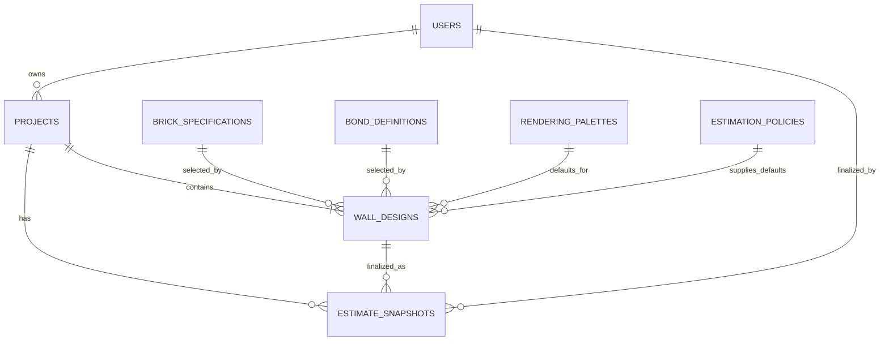
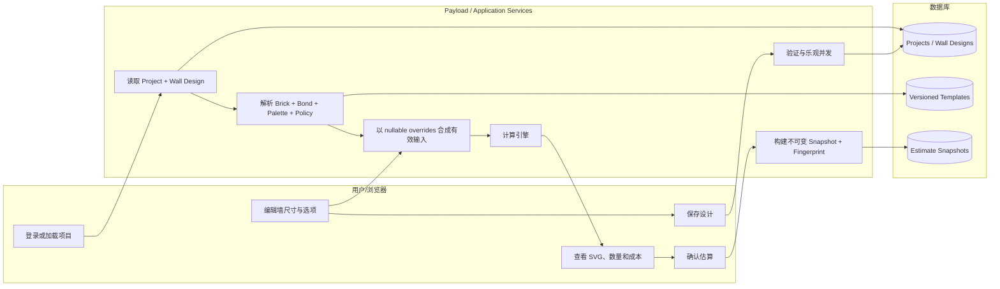

# 06 Payload 数据库设计策略——版本化参考数据与不可变快照

> 应用：Brick Wall Designer / RenoPilot application template  
> 依据：`04_Application_and_Conceptual_Data_Analysis.md`  
> 平台：Payload CMS 3；本地 SQLite，生产建议 PostgreSQL  
> 状态：设计提案，不授权代码实施

## 1. 结论

本应用适合采用**规范化参考数据 + 可编辑业务聚合 + 不可变估算快照**的混合策略，而不是纯单表，也不是把所有输入完全拆散。

选择理由：

- 砖型、砌筑方式、配色预设、工程默认值和费率会被很多设计重复使用，应集中管理并进行业务版本控制；
- 项目名称、墙体输入、切砖/压顶设置和用户覆盖值属于某个项目，应一起保存和频繁更新；
- SVG、单砖坐标、当前工程量和成本均可重新计算，不应在可编辑表中重复保存；
- 用户明确保存的估算如果以后成为商业记录，则必须保存完整、不可变的输入与结果快照。这类重复具有业务价值；
- 当前应用只支持一个项目一面墙，但数据库关系允许一个项目未来包含多面墙，避免再次迁移核心模型。

建议业务 Collections：

1. `projects`
2. `wall-designs`
3. `brick-specifications`
4. `bond-definitions`
5. `rendering-palettes`
6. `estimation-policies`
7. `estimate-snapshots`

现有 `users` 继续作为 Payload 身份与所有权实体。`pages`、`media` 等内容 Collections 不属于计算领域。

## 2. 对 04 文档的解读

### 2.1 已确认的数据边界

- 当前 JSON 的持久化边界是一个命名项目、一个墙体设计和一组估算覆盖值；
- 砖型有 5 个代码和固定尺寸，bond 有 7 个代码并选择不同算法分支；
- 颜色、压顶、切砖和调整方向随项目保存；
- 工程默认值、密度、材料费率、人工费率、最低收费和 GST 规则目前硬编码；
- 空白成本输入表示使用默认值，数值 `0` 表示明确覆盖为零；
- 布局、单砖图元、SVG、工程量、成本和报告都可重算，当前不持久化；
- 当前不存在用户所有权、正式报价、批准、锁定、审计或中央价格来源。

### 2.2 字段数量校正

04 文档文字称有 34 个 `u_*` 字段，但其字段表实际枚举 33 个。45 个 `state.values` 的组成也验证了 33：3 个几何输入 + 1 个砖型 + 1 个 skin + 7 个颜色 + 33 个 `u_*` = 45。本设计以**33 个**为准，实施前应以导入白名单测试再次核对。

### 2.3 设计假设

| 未确认事项 | 本设计采用的安全基线 |
|---|---|
| 实际读写比例 | 数据库总体按读多写少设计，上线后测量验证。 |
| 项目墙体数量 | UI 第一版创建一面墙；数据模型允许 1..N 面墙。 |
| 地区和币种 | 初始模板可为 AU/AUD，但金额必须显式携带币种。 |
| 正式报价 | 当前没有；预留不可变 estimate snapshot。 |
| 供应商定价 | 当前没有供应商证据；第一版使用统一、版本化政策。 |
| 历史可复现性 | 已确认的 estimate 必须可复现；普通预览可以重算。 |

## 3. 读写频率与架构选择

### 3.1 负载判断

04 文档没有生产统计，因此不能给出真实读写百分比。根据现有工作流可作如下定性判断：

| 数据/操作 | 读取频率 | 写入频率 | 设计处理 |
|---|---|---|---|
| 砖型、bond、palette、估算政策 | 高 | 很低 | 独立版本化参考表；允许应用级缓存。 |
| 项目列表和设计加载 | 高 | 中 | owner/lifecycle/updatedAt 建索引；按需 `select`。 |
| 用户输入与预览重算 | 极高（内存状态） | 不应同步等频写库 | 浏览器本地更新；显式保存或 2–5 秒 debounce。 |
| 保存设计 | 中 | 中 | 一次更新 `wall-designs`；使用乐观并发。 |
| 发布参考模板 | 低 | 很低 | 新增版本，不原地覆盖 active 版本。 |
| 保存正式估算 | 中低 | 低、仅追加 | 单事务创建不可变快照。 |
| SVG、砖坐标、诊断 | 极高生成 | 0 | 不持久化。 |

因此数据库预期是**读密集、计算密集、持久化写入受控**。如果前端把每次 `oninput` 都直接写数据库，写入量会被人为放大，应通过 debounce、保存按钮和脏状态合并写入。

### 3.2 推荐架构

```text
Browser / Payload Admin
          │
          ▼
Next.js + Payload API
          │
          ├── Project/Design Service ── projects + wall-designs
          ├── Template Resolver ─────── brick/bond/palette/policy
          ├── Calculation Engine ────── memory only for previews
          └── Estimate Finalizer ────── estimate-snapshots
                                      │
                                      ▼
                              PostgreSQL production DB
```

生产建议 PostgreSQL，原因是并发写入、事务、decimal 精度、复合/部分唯一约束和索引能力更适合持续增长的数据。SQLite 保留为本地开发数据库。

## 4. 会形成模板的参考数据

### 4.1 应建立版本化模板的内容

| 模板 | 当前证据 | 为什么不能复制到每个设计 | 建议 Collection |
|---|---|---|---|
| 砖型规格 | 5 个 code、名称和长宽高 | 同一尺寸会在大量设计中无意义重复；修正困难 | `brick-specifications` |
| Bond 定义 | 7 个 code、label、算法分支 | code/label 多处定义会漂移；算法兼容需版本 | `bond-definitions` |
| 渲染配色预设 | 7 个固定颜色随项目保存 | 相同默认 palette 会重复；以后可能有品牌/客户预设 | `rendering-palettes` |
| 估算政策 | 工程默认值、密度、配比、GST | 多项目共享；必须知道来源、地区、生效期和版本 | `estimation-policies` |
| 材料默认费率 | road base、steel、concrete、brick、cement、lime、sand | 调价不应批量覆写设计 | `estimation-policies.materialRates` |
| 人工费率和最低收费 | 5 类人工费率和最低费 | 多项目共享并随时间变化 | `estimation-policies.labourRates/minimumCharges` |
| Allowances | site access、waste disposal | 属于统一默认值，但允许项目覆盖 | `estimation-policies.allowances` |
| 税务/货币规则 | `$`、GST `/11` 当前硬编码 | 金额没有地区、币种和版本会失去含义 | `estimation-policies.tax/currencyCode` |

### 4.2 不建立数据库模板的枚举

`capping.orientation`、`noCutLengthAdjustment` 和 yes/no flags 直接决定代码分支，取值很少且不是管理员可自由扩展的数据。第一版保留为 Payload `select`/`checkbox`，随代码 schema 版本控制，不单独建表。

## 5. 有意义与无意义的重复存储

| 数据 | 在哪里重复 | 是否有意义 | 规则 |
|---|---|---|---|
| 砖 code/name/尺寸 | 每条可编辑设计 | 无意义 | 设计只关联准确的 `brick-specifications` 版本。 |
| bond label/规则 | 每条可编辑设计 | 无意义 | 设计只关联准确的 `bond-definitions` 版本。 |
| 整套默认费率/工程参数 | 每条设计 | 通常无意义 | 设计关联政策，并只保存用户明确覆盖值。 |
| 默认 palette 七个颜色 | 每条设计 | 无意义，除非用户自定义 | 使用 palette relationship；仅自定义时保存覆盖。 |
| 设计输入被复制进已确认 estimate | 有意义 | 是 | 保证商业记录可复现。 |
| 砖尺寸、政策有效值被复制进 estimate | 有意义 | 是 | 防止模板停用或引擎升级改变历史结果。 |
| 项目名称/owner 显示值进入 estimate | 有意义 | 是 | 保留确认时的商业展示内容。 |
| 派生工程量/成本保存在可编辑 design | 无意义且危险 | 否 | 输入变化后会陈旧；预览按需重算。 |
| 派生工程量/成本保存在 final estimate | 有意义 | 是 | 它是被确认的结果，不允许更新。 |

核心原则：**规范化用于当前共享事实；快照用于历史业务事实。**

## 6. 实体与关系



| 关系 | 基数与规则 |
|---|---|
| User—Project | 一个用户可拥有多个项目；每个项目必须有一个 owner。 |
| Project—Wall Design | 项目至少一面墙；当前 UI 只创建一面，数据库允许多面。 |
| Wall Design—Brick | 每面墙关联一个准确且不可变的砖型版本。 |
| Wall Design—Bond | 每面墙关联一个准确且不可变的 bond 版本。 |
| Wall Design—Palette | 每面墙关联一个 palette 版本，可选保存少量颜色覆盖。 |
| Wall Design—Policy | 每面墙关联一个政策版本；nullable overrides 覆盖默认值。 |
| Project/Wall Design—Estimate | 一个项目/墙可有多个仅追加 estimate snapshots。 |

## 7. 数据表设计与示例

以下是逻辑表设计。Payload 关系型 adapter 的实际列名和辅助版本表以 migration 为准。

### 7.1 `users`（现有认证实体）

| 字段 | Payload 类型 | 必填 | 规则 |
|---|---|---:|---|
| `email` | auth email | 是 | 唯一。 |
| `name` | text | 是 | 显示名称。 |
| `roles` | select, hasMany | 是 | `admin`、`estimator`、`viewer`；保存到 JWT。 |
| `isActive` | checkbox | 是 | 默认 true；仅 admin 可修改。 |
| `createdAt/updatedAt` | timestamps | 是 | 系统维护。 |

示例：

| id | email | name | roles | isActive |
|---:|---|---|---|---:|
| 12 | estimator@example.com | Alex Lee | estimator | true |

### 7.2 `projects`

| 字段 | 类型 | 必填 | 索引/规则 |
|---|---|---:|---|
| `projectCode` | text | 是 | 唯一、服务端生成。 |
| `name` | text | 是 | 1–160 字符，可搜索。 |
| `owner` | relationship → users | 是 | 索引；创建时由认证用户设置。 |
| `lifecycle` | select | 是 | `active`/`archived`；索引。 |
| `description` | textarea | 否 | 项目备注。 |
| `schemaVersion` | integer | 是 | 从 1 开始。 |
| `source.kind` | select | 是 | `native`/`legacy-json`。 |
| `source.applicationVersion` | text | 否 | 原文件版本。 |
| `source.legacySavedAt` | date | 否 | 不受信任的来源时间。 |
| `source.importedAt` | date | 否 | 服务端时间。 |
| `source.warningText` | textarea | 否 | 导入警告。 |
| `createdAt/updatedAt` | timestamps | 是 | `updatedAt` 用作并发 token。 |

示例：

| projectCode | name | owner | lifecycle | schemaVersion | source.kind |
|---|---|---:|---|---:|---|
| PRJ-2026-00042 | Smith Street Front Wall | 12 | active | 1 | legacy-json |

### 7.3 `brick-specifications`

| 字段 | 类型 | 必填 | 索引/规则 |
|---|---|---:|---|
| `key` | text | 是 | 唯一，例如 `s@1`。 |
| `code` | text | 是 | 索引；跨版本稳定。 |
| `version` | integer | 是 | `(code, version)` 唯一。 |
| `name` | text | 是 | 显示名称。 |
| `lengthMm/widthMm/heightMm` | integer | 是 | 全部 > 0。 |
| `lifecycle` | select | 是 | `draft`/`active`/`retired`。 |
| `effectiveFrom/effectiveTo` | date | 否 | 同一 code 的 active 区间不重叠。 |
| `sourceReference` | text | 否 | 标准或供应来源。 |
| `supersedes` | relationship → self | 否 | 指向前一版本。 |

示例：

| key | code | version | name | lengthMm | widthMm | heightMm | lifecycle |
|---|---|---:|---|---:|---:|---:|---|
| s@1 | s | 1 | Standard | 230 | 110 | 76 | active |

初始记录另有 `l@1` 290×90×47、`u@1` 290×90×76、`m@1` 190×90×90、`r@1` 290×90×40。

### 7.4 `bond-definitions`

| 字段 | 类型 | 必填 | 索引/规则 |
|---|---|---:|---|
| `key` | text | 是 | 唯一，例如 `stretcher@1`。 |
| `code` | text | 是 | 跨版本稳定。 |
| `version` | integer | 是 | `(code, version)` 唯一。 |
| `label` | text | 是 | 用户可读名称。 |
| `engineRule` | select/text | 是 | 只能映射已发布的算法策略。 |
| `lifecycle` | select | 是 | `draft`/`active`/`retired`。 |
| `effectiveFrom/effectiveTo` | date | 否 | 生效区间。 |
| `supersedes` | relationship → self | 否 | 前一版本。 |

示例：

| key | code | version | label | engineRule | lifecycle |
|---|---|---:|---|---|---|
| stretcher@1 | stretcher | 1 | Stretcher Bond | stretcher-v1 | active |

### 7.5 `rendering-palettes`

| 字段 | 类型 | 必填 | 规则 |
|---|---|---:|---|
| `key` | text | 是 | 唯一，例如 `default@1`。 |
| `code/version/name` | text/integer/text | 是 | `(code, version)` 唯一。 |
| `oddStretcher/evenStretcher/headerBrick` | text | 是 | 六位 hex 颜色。 |
| `specialBrick/cutBrick/mortar/cappingBrick` | text | 是 | 六位 hex 颜色。 |
| `lifecycle` | select | 是 | `draft`/`active`/`retired`。 |

示例：

| key | name | oddStretcher | evenStretcher | mortar | cappingBrick | lifecycle |
|---|---|---|---|---|---|---|
| default@1 | RenoPilot Default | #C1440E | #A63A0C | #D4C8B0 | #710000 | active |

### 7.6 `estimation-policies`

此表的一条记录是一套完整默认值，不拆成 33 条键值记录，以避免无类型 EAV 模型和大量 join。

| 字段组 | 类型 | 必填 | 内容/规则 |
|---|---|---:|---|
| `key/code/version/name` | typed scalars | 是 | `key` 唯一，`(code, version)` 唯一。 |
| `lifecycle` | select | 是 | `draft`/`active`/`retired`。active 后不可原地修改。 |
| `regionCode/currencyCode` | text | 是 | 初始可为 AU/AUD。 |
| `tax` | group | 是 | name、ratePercent、pricesIncludeTax。 |
| `site` | group | 是 | sideClearanceMm、endClearanceMm。 |
| `foundation` | group | 是 | footingExtensionMm、ratio、meshInsetMm、meshLayerCount、roadBaseDepthMm、compactionPercent、steelBarLengthM。 |
| `materials` | group | 是 | brick/mortar contingency、cement/lime/sand mix。 |
| `densities` | group | 是 | cement/lime/sand kg/m³。 |
| `materialRates` | group | 是 | roadBase、steelBar、concrete、brick、cement、lime、sand。 |
| `allowances` | group | 是 | siteAccess、wasteDisposal。 |
| `labourRates` | group | 是 | preparation、trench、compaction、pour、bricklaying。 |
| `minimumCharges` | group | 是 | preparation、trench、compaction、pour、bricklaying。 |
| `effectiveFrom/effectiveTo` | date | 是/否 | 同一地区/币种的 active 区间不重叠。 |
| `approvedBy/approvedAt/sourceReference` | relationship/date/textarea | 否 | 生产启用时建议必填。 |
| `supersedes` | relationship → self | 否 | 前一政策版本。 |

示例：

```json
{
  "key": "AU-AUD-2026@1",
  "code": "AU-AUD-2026",
  "version": 1,
  "lifecycle": "active",
  "regionCode": "AU",
  "currencyCode": "AUD",
  "tax": { "name": "GST", "ratePercent": 10, "pricesIncludeTax": true },
  "site": { "sideClearanceMm": 1500, "endClearanceMm": 2000 },
  "materialRates": { "roadBase": 50, "steelBar": 18, "concrete": 400, "brick": 2, "cement": 0.5, "lime": 1.1, "sand": 0.1 },
  "labourRates": { "preparation": 0, "trenchExcavation": 50, "roadBaseCompaction": 20, "concretePour": 50, "bricklaying": 2 }
}
```

### 7.7 `wall-designs`

这是用户最频繁更新的计算输入聚合。Capping、cutting 和 overrides 是内嵌 value objects，不独立建表。

| 字段组 | 类型 | 必填 | 索引/规则 |
|---|---|---:|---|
| `project` | relationship → projects | 是 | 索引；当前 UI 每项目创建一条。 |
| `wallCode/name/sequence` | text/text/integer | 是 | `(project, sequence)` 唯一。 |
| `brickSpecification` | relationship | 是 | 指向准确 brick version；索引。 |
| `bondDefinition` | relationship | 是 | 指向准确 bond version；索引。 |
| `renderingPalette` | relationship | 是 | 指向准确 palette version。 |
| `estimationPolicy` | relationship | 是 | 指向准确 policy version；索引。 |
| `geometry` | group | 是 | enteredLengthMm、enteredHeightMm、mortarJointMm、skinCount=2。 |
| `cutting` | group | 是 | cutBricksAllowed、noCutLengthAdjustment。 |
| `capping` | group | 是 | included、orientation、endOffset。 |
| `paletteOverrides` | group | 否 | 7 个 nullable hex；仅与模板不同时保存。 |
| `overrides` | groups of nullable numbers | 否 | 与政策相同的 33 个计算字段；null=继承，0=明确覆盖。 |
| `calculationEngineVersion` | text | 是 | 上次保存/验证使用的引擎版本。 |
| `schemaVersion` | integer | 是 | 输入 schema 版本。 |
| `createdAt/updatedAt` | timestamps | 是 | 乐观并发。 |

示例：

```json
{
  "project": 42,
  "wallCode": "WALL-001",
  "name": "Primary Wall",
  "sequence": 1,
  "brickSpecification": 101,
  "bondDefinition": 201,
  "renderingPalette": 301,
  "estimationPolicy": 401,
  "geometry": { "enteredLengthMm": 6000, "enteredHeightMm": 1800, "mortarJointMm": 10, "skinCount": 2 },
  "cutting": { "cutBricksAllowed": false, "noCutLengthAdjustment": "shorter" },
  "capping": { "included": true, "orientation": "flat", "endOffset": false },
  "overrides": { "materialRates": { "brick": 2.25 }, "minimumCharges": { "bricklaying": 0 } },
  "calculationEngineVersion": "18.0.0",
  "schemaVersion": 1
}
```

未显示的 override 为 null；上例的最低砌砖费 `0` 必须保留为明确覆盖。

### 7.8 `estimate-snapshots`

仅在用户明确保存/确认估算时创建。创建后禁止 update；作废通过状态和 `voidedAt` 表示，不删除原记录。

| 字段 | 类型 | 必填 | 索引/规则 |
|---|---|---:|---|
| `estimateNumber` | text | 是 | 唯一。 |
| `project/wallDesign` | relationships | 是 | 索引，用于导航；不作为复现的唯一来源。 |
| `createdBy/calculatedAt` | relationship/date | 是 | 服务端设置。 |
| `status` | select | 是 | `confirmed`/`voided`。 |
| `engineVersion/inputSchemaVersion` | text/integer | 是 | 精确计算版本。 |
| `inputFingerprint` | text | 是 | 规范化输入 SHA-256；索引。 |
| `currencyCode/policyKey/brickKey/bondKey` | text | 是 | 提升为可查询字段。 |
| `inputSnapshot` | json | 是 | 设计输入、完整参考值、完整政策值和 overrides。 |
| `quantitySnapshot` | json | 是 | 实际尺寸、砖数、基础、钢筋、砂浆和质量。 |
| `costSnapshot` | json + typed totals | 是 | 明细以及 materialTotal、labourTotal、taxAmount、grandTotal。 |
| `warningText` | textarea | 否 | 确认时的警告。 |
| `voidedAt/voidedBy/voidReason` | date/relationship/text | 否 | 只允许受控作废。 |

示例：

| estimateNumber | project | wallDesign | policyKey | brickKey | currency | grandTotal | status |
|---|---:|---:|---|---|---|---:|---|
| EST-2026-00018 | 42 | 77 | AU-AUD-2026@1 | s@1 | AUD | 18432.55 | confirmed |

`inputSnapshot` 内再次保存 `s@1` 的 230×110×76 和当时所有有效费率。这是有意义的重复：即使模板以后 retired，estimate 仍可独立解释和复现。

## 8. 模板版本、更新与删除规则

业务版本字段比 Payload 自动 versions 更重要；两者用途不同：

- `code` 表示稳定业务概念，例如 `s`；
- `version` 表示业务版本，例如 1、2；
- `key` 为唯一身份，例如 `s@2`；
- `lifecycle` 为 `draft`、`active`、`retired`；
- active 或已被引用的版本不可修改影响计算的字段；
- 修正或调价时复制成新版本，并用 `supersedes` 指向旧版本；
- 每个 code 同一时点只能有一个 current/active 版本；
- 被 design 或 estimate 引用的版本禁止硬删除，只能 retired；
- retired 版本不出现在新建选择列表，但历史关系仍可读取。

例如 `s@1` 高度 76 mm 需要改为 75 mm：创建 `s@2`，新设计默认选择 `s@2`，旧设计仍指向 `s@1`。不能对数万条设计执行隐式批量更新。

如果业务明确要求把未确认的设计迁移到新版本，应先生成影响清单，再通过显式、可审计的批处理更新指定 designs。`estimate-snapshots` 永远不迁移、不更新。

Payload Versions 可用于编辑审计和恢复，但不能替代上述业务版本。建议 projects/wall-designs 保留有限版本历史；reference/policy 的业务不可变性仍通过 access、hook 和数据库约束执行。

## 9. Application 数据流



运行规则：预览计算不写数据库；保存只更新项目/设计输入；确认估算时，在同一事务中重新读取权威记录、解析模板和覆盖值、重新计算、生成 fingerprint，再插入 snapshot。嵌套 Payload 操作必须传递同一个 `req`。

## 10. 索引、查询与一致性

| 表 | 关键索引/约束 |
|---|---|
| projects | unique projectCode；`(owner, lifecycle, updatedAt desc)`；name search。 |
| wall-designs | unique `(project, sequence)`；project、brick、bond、policy relationship indexes。 |
| 各 reference 表 | unique key；unique `(code, version)`；lifecycle/effectiveFrom。 |
| estimation-policies | unique key；`(regionCode, currencyCode, lifecycle, effectiveFrom)`。 |
| estimate-snapshots | unique estimateNumber；`(project, calculatedAt desc)`；`(project, inputFingerprint)`。 |

所有金额、比率和体积使用明确 precision/scale 的 decimal；最终金额也可同时保存最小货币单位整数。mm 和 count 使用 integer。API 数值必须是 JSON number，旧版字符串只在导入边界转换。

创建项目及第一面墙、确认 estimate、作废 estimate 都必须使用事务。代表用户调用 Local API 时传 `user` 和 `overrideAccess: false`。关系删除采用 restrict，不级联删除历史。

## 11. 旧 JSON 迁移

1. 限制文件大小并解析版本化 schema；无版本旧文件标为 v0；
2. 校验 45 个 value keys 和 6 个 radio groups；
3. 数字字符串转换为有限数值，拒绝未知枚举；
4. `BT`/bond code 解析到准确的 version-1 reference；
5. 颜色匹配已有 palette；不匹配时保留为 design overrides；
6. 选择初始 estimation policy；空白 `u_*` 保存 null，数值 0 保留；
7. 在一个事务中创建 project 和 wall design；
8. 服务端重新计算，只返回 warnings，不导入旧派生结果。

## 12. 分阶段实施建议

### 第一阶段：可靠持久化

- users、projects、wall-designs；
- brick、bond、palette、policy 版本化 reference；
- owner access、索引、事务和旧 JSON 导入；
- 预览结果按需计算。

### 第二阶段：测量与优化

- 记录每类 endpoint 的读取、写入、延迟和 payload size；
- 根据真实数据调整 debounce、cache、`select`、pagination 和索引；
- 生产迁移 PostgreSQL。

### 第三阶段：商业快照

- 业务确认“正式/接受”的状态后启用 estimate snapshots；
- 固定输入、reference/policy 内容、结果、engine version 和 fingerprint；
- 如需法律报告，再增加与 snapshot 关联的报告文件实体。

## 13. 仍需业务确认

1. 一个项目未来是否会有多面墙？
2. 正式报价的确认、作废、保留和审批规则是什么？
3. 默认费率来自统一价目表还是供应商报价？谁可以发布新版本？
4. AU/AUD/GST 10% 是否为权威初始范围，价格是否含税？
5. `u_cost_steel` 的“标准长度”和 `u_lab_pour` 的准确计价单位是什么？
6. palette 是否为共享模板，还是每个项目始终独立？
7. 项目是否需要团队/organisation 共享？

## 14. 最终建议

采用关系型、版本化的混合模型：参考数据只保存一次并由设计关联；用户覆盖值保存在可编辑设计中；可重算输出不进入当前状态表；只有被明确确认的 estimate 才复制完整输入、模板内容和结果，形成不可变快照。

该策略消除了砖型、bond 和默认费率在大量设计中的无意义重复，又保留了历史报价所需要的有意义重复。它也把高频浏览器计算与数据库写入分离，适合数据量持续增长但实际读写比例尚未测量的阶段。
