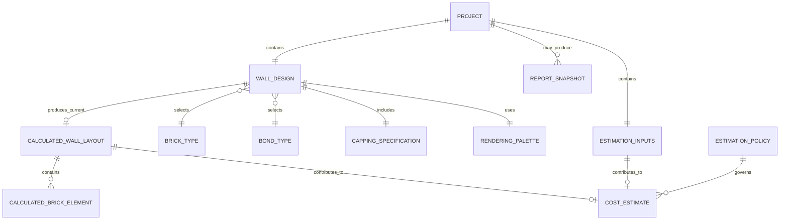

# 02 Data Discovery and Conceptual Model Report

> Analysis target: `BrickWallDesigner_v18.html`  
> Evidence: **Confirmed** = source-confirmed; **Inferred** = evidence-supported inference; **Unknown** = not confirmable.  
> **Candidate business entities are not final database tables.** This report does not prescribe final tables, columns, keys, database types, indexes, SQL, APIs, or implementation.

# 1. Data Domain Classification

| Data | Meaning/type/example | Source | Classification and rationale | Confidence/confirmation |
|---|---|---|---|---|
| Project metadata | name, appName/version, savedAt; string/datetime | Save JSON | Snapshot/audit metadata for one file save | **Confirmed / High**; version/audit meaning needs confirmation |
| Wall design inputs | dimensions, mortar, brick, bond, cuts, adjustment, capping | Designer UI | Persistent design input | **Confirmed / High** |
| Wall construction | double skin `2` | hidden field + fixed getter | Configuration/persistent input; fixed and not editable | **Confirmed / High**; future variability unknown |
| Render colours | 7 hex colours | hidden inputs | Configuration/persistent input; affects graphics only | **Confirmed / High**; business relevance unknown |
| Brick catalogue | 5 codes/names/dimensions | `BRICK_TYPES`,`BRICK_NAMES` | Reference data | **Confirmed / High** |
| Bond catalogue | 7 codes/labels | radios, `NAMES`,`ALL_BOND_VALUES` | Reference allowed values | **Confirmed / High** |
| Capping options | yes/no, orientation, offset | radios | Reference values + persistent input | **Confirmed / High** |
| Estimation overrides | 34 optional numeric strings for site, footing, materials, waste, price, labour | Page 2 `u_*` | Persistent design/configuration overrides | **Confirmed / High** |
| RenoPilot defaults | default costs and engineering parameters | `userOrDefault` literals/UI | Configuration used when input is blank | **Confirmed / High**; source, region, effective date **Unknown** |
| Calculation parameters | densities, GST rule, search steps/tolerances | JS literals | Hard-coded configuration/derived rules | **Confirmed / High**; governance **Unknown** |
| Layout geometry | actual dimensions, courses, brick coordinate/type arrays | `calculateLayout` | Derived, recalculable data | **Confirmed / High** |
| `WALL` summary | dimensions, counts, bond, ready | `drawWall` | Derived cross-page application state | **Confirmed / High** |
| Material quantities | footing, mesh, steel, bricks, mortar, mass | `recalculateCosts` | Derived data | **Confirmed / High** |
| Cost estimate | materials, labour, total, GST | `recalculateCosts` | Derived transaction-like result; not persisted | **Confirmed / High**; snapshot need unknown |
| SVG/report | SVG, HTML report, display text | render/populate/print | Display-only / snapshot candidate | **Confirmed / High** |
| Diagnostics | range, step, failures | modal | Temporary UI/test data | **Confirmed / High** |
| UI state | page, scale, collapse, messages | DOM/locals | Temporary UI state | **Confirmed / High** |
| User/account/ownership | identity, customer, permissions | Not found | Unknown domain absent from code | **Unknown / Low**; human confirmation required |
| Audit/version history | actor, reason, revisions | Not found | Unknown; savedAt is not an audit trail | **Unknown / Low** |

# 2. Reference and Configuration Data

## 2.1 Brick Types

Used for brick dimensions, labels, layout, minimum wall length, quantities, and costs. Source L2150-L2163; read by `getBrick`, layout, diagnostics, render, and report.

| code | name | length mm | width mm | height mm |
|---|---|---:|---:|---:|
| s | Standard | 230 | 110 | 76 |
| l | Slimline | 290 | 90 | 47 |
| u | Utility | 290 | 90 | 76 |
| m | Modular | 190 | 90 | 90 |
| r | Roman | 290 | 90 | 40 |

Five records; updated only by editing source code; no management UI/API. Currently application-specific, although brick specifications are a potential shared reference set. No records are marked as test data. **Confirmed**.

## 2.2 Bond Types

Seven code/label records: stretcher, header, english, englishGardenWall, flemish, flemishGardenWall, and common. Sources L1063-L1076, L4752-L4760, L5158-L5166. Each drives a different layout/minimum-length formula. Source-maintained; potentially shareable, although algorithms are application-coupled. **Confirmed/Inferred**.

## 2.3 Colours

Seven code/value entries: C1 `#C1440E`, C2 `#A63A0C`, C6 `#8B3A0C`, C3 `#8B6914`, C4 `#AE0000`, C5 `#D4C8B0`, CHR `#710000`, mapped to odd/even/header/special/cut/mortar/capping. Sources L1115-L1121 and L4997-L5008. Hidden but saved; no visible editing UI. Application-specific. **Confirmed**.

## 2.4 Products, Components, and Options

- Materials: road base, reinforcing steel, concrete, bricks, cement, lime, sand (7). **Confirmed**.
- Labour/allowances: site access, waste disposal, work-area preparation, trench excavation, road-base compaction, concrete pour, bricklaying (7), plus 5 minimum charges. **Confirmed**.
- Capping: no/yes, flat/vertical/soldier orientation, yes/no offset. **Confirmed**.
- Construction: fixed two-skin wall. **Confirmed**.

These are labels and algorithm parameters rather than external product catalogues. Supplier, SKU, region, currency, and effective-date data are absent; shareability is **Unknown**.

## 2.5 Units, Defaults, and Calculation Parameters

| Dataset | Values/examples | Count | Maintenance/share/test status |
|---|---|---:|---|
| Geometry units | mm, m, m², m³, count | 5 types | Code-fixed; potentially shared; not test |
| Cost units | $, $/m², $/m³, $/kg, $/brick, $/length | 6 types | Currency unspecified; GST suggests Australia but needs confirmation |
| Engineering defaults | side 1500mm, end 2000mm, extension 100mm, ratio 4, inset 50mm, layers 2, road base 100mm, compaction 10%, steel 8m, contingencies 10% | 10 | `userOrDefault`; source-maintained; future configuration candidates |
| Mortar mix | 1:0:4 | 3 parts | Source-maintained |
| Densities | cement 1440, lime 500, sand 1600 kg/m³ | 3 | Hard-coded; source/standard **Unknown** |
| Material-cost defaults | 50, 18, 400, 2, 0.5, 1.1, 0.1 by unit | 7 | Hard-coded; region/date **Unknown** |
| Labour defaults/minima | rates 0/50/20/50/2; minima 0/500/0/500/1000; allowances 0/0 | 12 | Hard-coded; region/date **Unknown** |
| GST | included component = grand total / 11 | 1 rule | Hard-coded; tax rate/applicability not modelled |
| Diagnostic presets | min 600, max 10000, step 1, mortar 17, cuts-only true | 5 | Sample/test data; not persisted |

# 3. Save, Load, Import, and Export Structures

## 3.1 Save/Export JSON (**Confirmed**)

```text
project
├─ appName: "Brick Wall Designer"
├─ appVersion: "v16"
├─ projectName: user text
├─ savedAt: browser-generated ISO timestamp
└─ state
   ├─ values: map of 45 HTML element IDs to string values
   └─ radios: map of 6 radio names to selected string values
```

`values` contains BT, MJ, WL, WH, seven colours, sk_hidden, and 34 `u_*` overrides. `radios` contains bond, cu, ad, cc, cco, ccoff. All originate from DOM `.value`, so numeric inputs remain JSON strings. **Confirmed**.

## 3.2 Load/Import (**Confirmed**)

Load requires only parseable JSON and access to `project.state`; it performs no schema, app/version, type, or range validation. `applyProjectState` reads only whitelisted keys: present values replace DOM state, missing values leave current UI state, unknown fields are ignored, and radios require exact value matches. It then redraws and recalculates. `projectName` returns to `sp_name`; savedAt is display-only; appName/appVersion are not read.

## 3.3 Symmetry and Gaps

| Check | Conclusion |
|---|---|
| Save/Load fields | Values and radios use identical lists: **Confirmed symmetric**. |
| Import/Export | Download/upload share one JSON format: **Confirmed statically**; round trip **Unknown**. |
| Read but not persisted | appName/version unused on Load; savedAt display-only; derived WALL/layout/report/costs and diagnostic/UI state unsaved. **Confirmed**. |
| Saved but ineffective on restore | `sk_hidden` is restored to DOM, but business getter always returns 2; colours restore and affect rendering. **Confirmed**. |
| Legacy compatibility | No explicit migration; missing-field tolerance and unknown-field ignoring offer limited compatibility. **Confirmed/Inferred**. |
| Default supplementation | Missing fields keep current HTML values; blank cost inputs use `userOrDefault`. **Confirmed**. |
| Local/Session/IndexedDB and API | No structures exist. **Confirmed**. |
| Report export | Temporary HTML + cloned SVG + browser print, not project JSON. **Confirmed**. |

# 4. Data Lineage

| Data item | Source | UI control | JS variable | Transformation | Persistence | Reload |
|---|---|---|---|---|---|---|
| Project name | user | `sp_name` | `nameInput` | trim; filename sanitized separately | root `projectName` + filename | → `sp_name` |
| Saved time | browser clock | none | `savedAt` | ISO; locale display on load | root `savedAt` | status only |
| Wall length/height | user/default | `WL`,`WH` | entered values/layout | parse/fallback; courses and possible length adjustment | `state.values` | apply → draw → WALL |
| Mortar | user/default | `MJ` | `mortar` | parse; 0/NaN→10 | `state.values.MJ` | apply → layout/cost |
| Brick/bond | user | `BT`,`bond` | codes/reference lookup | dimension/label lookup; algorithm branch | values/radios | apply → layout |
| Cut/adjust/capping | user | `cu`,`ad`,`cc`,`cco`,`ccoff` | booleans/codes | actual length, cut, conditional capping geometry/count | radios | apply → UI/layout |
| Colours | embedded defaults | hidden `C*` | `colorMap` | type→SVG fill | values | apply → render |
| Estimation override | user/blank | `u_*` | local numbers | blank→default; parse; unit conversion | values | apply → recalculate |
| Geometry/counts | design/reference | display only | layout, counts, WALL | bond formulas, coordinates, multipliers | not persisted | recompute |
| Materials/cost/GST | WALL + defaults/overrides | `cv_*`,`rp_*` | cost locals/totals | conversion, ceiling, mix/density, sums, minima, total/11 | not persisted | recompute |
| Report | SVG/WALL/cost DOM | report page | cloned SVG/HTML | format/display/print | browser target only | no app reload |

# 5. Source of Truth and Data Ownership

| Data class | Current source of truth / creator | Readers | Duplication/conflict risk | Future candidate |
|---|---|---|---|---|
| Design inputs | Active DOM, user-edited; file is offline snapshot | layout/save | Unsynchronised JSON copies; DOM can diverge from last download | **Inferred** managed project/design repository |
| Brick/bond reference | Source constants plus duplicated HTML values/labels | UI/layout/diagnostics/report | Code/label/dimension drift | **Inferred** shared versioned catalogue |
| Defaults/rates | JS literals plus HTML display text | cost/UI | Display and algorithm may diverge; no region/date | **Inferred** versioned estimation policy |
| Derived layout/counts | Current calculation engine | render/cost/report | Recalculation may change with new code | Algorithm; version/snapshot if reproducibility required |
| Cost estimate | Current DOM/locals | report | Not persisted; new defaults change old-project results | **Inferred** optional estimate snapshot + policy version |
| Project JSON | User filesystem | Load | Duplicate files and concurrent changes unmanaged | **Inferred** application-managed storage |
| User/owner | Absent | None | No ownership, authorization, user query | **Unknown** identity/organisation system |

Only an anonymous browser user and the calculation engine create/modify data. No person, team, or account is modelled; cross-application use is absent.

# 6. Persistence Requirements

| Data | Long-term reason | Recalculable | History/snapshot | Delete/archive/audit | Shared | Status |
|---|---|---|---|---|---|---|
| Project metadata | Yes; identify saved design | Name: no | savedAt is one point-in-time value; revision need unknown | Policy unknown | Possible | **Confirmed current; future Inferred/Unknown** |
| Design inputs | Yes; restore user choices | No | Version if traceability required | Unknown | Mainly app-specific | **Confirmed** |
| Estimation overrides | Yes; affect results | No | With design version | Unknown | Preference sharing unknown | **Confirmed current** |
| Reference catalogues | Persist in code | Not project-derived | Version if specifications change | Management audit inferred | Strong shared candidate | **Confirmed/Inferred** |
| Default policy | Persists in code | Cannot reconstruct from project | Version/effective-date snapshot needed for reproduction | Update audit inferred | Shared candidate | **Inferred** |
| Geometry/SVG | Not currently saved | Yes | Only if legal/reproduction need | Usually with design | No | **Confirmed current; future Unknown** |
| Quantities/costs | Not currently saved | Yes, dependent on algorithm/default version | Immutable snapshot may be needed for quote/approval | Unknown | Report consumer possible | **Inferred; confirm** |
| Diagnostic/UI state | No | Yes/defaultable | No evidence of need | Disposable | No | **Confirmed/Inferred** |

# 7. Conceptual Business Entities

**Candidate business entities are not final database tables.**

| Candidate | Meaning and main data | Identity/maintenance | Owner/lifecycle | Scope | Evidence |
|---|---|---|---|---|---|
| Project | Named save boundary: metadata, savedAt, design state | Filename/name only; independently saved/loaded | Anonymous user; external file lifecycle | App-specific; aggregate-root candidate | **Confirmed** JSON |
| Wall Design | Persistent wall dimensions and selections | No independent ID; edited as a whole | Owned by Project; no explicit status | App-specific | **Confirmed** |
| Estimation Inputs | Engineering, waste, prices, labour, minima overrides | No ID; changes with Project | Component/value-object candidate | Sharing unknown | **Confirmed** |
| Brick Type / Bond Type | Reference codes, labels, dimensions/algorithm selection | Code candidate identifier; source-maintained | Application release | Potentially shared | **Confirmed** |
| Capping Specification | include, orientation, offset | No identity; value-object candidate | Follows design | App-specific | **Confirmed** |
| Rendering Palette | category colours | No identity; configuration/value object | Saved with project | App-specific | **Confirmed** |
| Estimation Policy | defaults, rates, densities, GST | No current ID/version | Application maintainer | Potentially shared | **Inferred** |
| Calculated Wall Layout | actual dimensions, courses, geometry/counts | Derived snapshot candidate | Replaced on recalculation | App-specific | **Confirmed derived** |
| Cost Estimate / Report Snapshot | quantities, costs, GST / rendered report | No current persistent identity | Replaced/generated on demand | Potentially shared | **Inferred** |
| User/Customer/Site | Possible business subjects | Absent | Unknown | Cross-application possible | **Unknown**; only help text mentions client/site |

Project is the aggregate-root candidate; Wall Design and Estimation Inputs are stored together in its state. This ownership is **Inferred**.

# 8. Entity Relationships and Cardinality

1. One Project currently contains exactly one Wall Design. **Confirmed for current JSON**.
2. Each Wall Design selects exactly one Brick Type and one Bond Type; either reference may serve zero or many designs. **Confirmed**.
3. Each Wall Design has one Capping Specification; orientation/offset remain saved but inactive when include=no. **Confirmed**.
4. Each Project contains one set of Estimation Inputs; each override may be blank. **Confirmed**.
5. A Wall Design produces zero or one current Calculated Layout; recalculation replaces it. A layout contains zero or more calculated brick graphics with no persistent identity. **Confirmed**.
6. A current layout and estimation inputs can produce one current Cost Estimate; no wall drawn means no cost result. **Confirmed**.
7. Multiple historical design versions, estimates, reports, and Project-to-User/Customer/Site relationships are **Unknown** and unsupported today.

No foreign-key implementation is defined here.

# 9. CRUD Matrix

| Entity | Create | Read | Update | Delete/Archive | Actor/function |
|---|---|---|---|---|---|
| Project | Save creates JSON | Load | Another Save creates a new file | None | anonymous user; `saveProject`,`loadProject` |
| Wall Design | defaults + first Draw | draw/report/save/cost | Change controls and Draw | None; New does not clear | user; `drawWall`,`collectProjectState` |
| Estimation Inputs | blank HTML/user input | cost/save | oninput | Clearing restores default semantics | user; `recalculateCosts` |
| Brick/Bond Type | source definition | UI/layout/report/diagnostics | source edit only | source edit only | maintainer |
| Capping/Palette | defaults | layout/render/save | radios or imported hidden values | With project | user/app/import |
| Estimation Policy | source literals | cost engine | new code release | None | maintainer |
| Calculated Layout/Cost | calculation functions | render/report | replaced by recalculation | memory overwrite/page close | engine |
| Report Snapshot | populate/print | print UI | regenerate | Unmanaged | user/browser |

# 10. Data Lifecycle

Open file → HTML defaults → user edits → Draw creates layout/WALL → cost engine creates current estimate → view/print → Save creates standalone JSON snapshot → later Load overwrites whitelisted inputs → redraw/recalculate. Unsaved data is lost when the page closes. **Confirmed**.

There are no Draft/Approved/Archived/Deleted business states. `WALL.ready` is runtime readiness, not approval status. Loading, editing, and saving do not form a managed revision chain; deletion, archival, and audit are external file-management concerns. **Confirmed**. Reproducible estimates would require design inputs plus reference/configuration, algorithm version, and possibly estimate snapshot. **Inferred requirement**.

# 11. Data Integrity Rules

| Rule | Data/trigger | Evidence | Status |
|---|---|---|---|
| Project name required for Save | `sp_name` | L2771-L2778 | **Confirmed** |
| Filename trimmed; forbidden characters→`-`; empty→default; max 120 chars | filename | L2746-L2751 | **Confirmed** |
| HTML ranges WL 100..50000, WH 100..10000, MJ 0..30 | UI | L1024-L1030 | **Confirmed**; Load does not revalidate |
| Blank/0/NaN getters fall back: WL 1235, WH 1750, MJ 10 | dimensions | L2200,L2205-L2206 | **Confirmed**; HTML 0 conflicts with effective behaviour |
| Brick code must resolve among five references | BT/layout | `getBrick` | **Inferred requirement**; Load unvalidated |
| Bond must be one of seven; radio enums fixed | layout | HTML/NAMES/branches | **Confirmed allowed values**; bad Load may remove selection |
| All walls are double-skin | construction | UI + `getSkinCount` | **Confirmed** |
| Capping settings apply only when cc=yes; no-cut adjustment applies when cuts disabled | cross-field | UI/layout handlers | **Confirmed** |
| Wall must meet bond/brick/mortar minimum | Draw | `minLength` guard | **Confirmed** |
| Geometry starts at 0, ends at actual length, has no negative widths, and uses 0.5mm mortar-gap tolerance | layout | L5188-L5207 | **Confirmed** |
| Diagnostics require max>min and step>0 | diagnostics | L4838-L4843 | **Confirmed** |
| Cost blank→default; zero valid; otherwise parseFloat | `u_*` | L5514-L5520 | **Confirmed** |
| Cost HTML min=0; compaction max=100 | cost UI | HTML | **Confirmed**; import/calculation do not enforce |
| Zero mix total produces zero component volume | mix | L5646-L5658 | **Confirmed** |
| Ordered bricks use ceiling after contingency | count | L5619-L5621 | **Confirmed** |
| Labour uses max(calculated, minimum); GST=total/11 | costs | L5715-L5754 | **Confirmed**; GST applicability unknown |
| Save whitelist is 45 IDs + 6 groups | state | L2655-L2716 | **Confirmed** |
| JSON schema/version/type/range validation is absent | Load | Load path | **Confirmed gap** |
| Project uniqueness and historical-reference deletion rules | name/reference | No evidence | **Unknown** |

# 12. Data Access Patterns

| Pattern | Current support | Requirement status |
|---|---|---|
| By ID/user/status/history/cross-application | No IDs, users, business states, history, or sharing | **Unknown future** |
| By project | User selects a file; no project list | **Confirmed limitation** |
| Load/export full design | Whole JSON state | **Confirmed** |
| Reference query | In-memory map/code lookup | **Confirmed** |
| Report export | Browser print HTML/SVG | **Confirmed statically** |
| Bulk load/search | No | **Confirmed limitation** |

# 13. Data Volume and Growth

| Metric | Evidence/estimate |
|---|---|
| Persistent inputs/design | 45 values + 6 radios + 4 root metadata; fixed upper bound — **Confirmed** |
| Brick graphics/design | Varies by dimensions/brick/bond/height; no measured business maximum — **Unknown** |
| Designs/user | No user/repository — **Unknown** |
| References | 5 brick types; 7 bonds; 7 material categories; 7 allowance/labour categories; 5 minimum charges — **Confirmed** |
| Revision growth | Unmanaged; arbitrary JSON copies — **Unknown** |
| Source HTML | 217,237 bytes — **Confirmed** |
| Project JSON/report size | No runtime sample — **Unknown**; likely small because geometry/images are excluded is **Inferred** |
| Images | None; SVG generated. Export size **Unknown** |
| Bulk demand | Diagnostics batches calculations; business projects have no bulk operations — future **Unknown** |

# 14. Data Quality and Modelling Risks

| Risk | Finding | Status/impact |
|---|---|---|
| Version inconsistency | filename v18, UI/save v16, provenance v15 | **Confirmed / High** |
| Inconsistent types | numbers saved as strings, parsed for calculation | **Confirmed / High** |
| Missing-value semantics | blank override means default; missing Load key retains current value | **Confirmed / High**: missing ≠ zero ≠ default |
| Duplicate definitions | brick/bond/defaults repeated across HTML and JS | **Confirmed / High**: drift |
| Mixed units/currency ambiguity | mm/m/m²/m³/kg/count/$; no currency/region/effective date | **Confirmed / High** |
| Weak identifiers/orphans | no project ID; imported unknown BT/bond unvalidated | **Confirmed/Inferred / High** |
| Sample mixed with production | diagnostic defaults and sample name embedded but unsaved | **Confirmed / Low** |
| Save/load mismatch | symmetric state; version unread; skin saved but ignored | **Confirmed / Medium** |
| Derived-data drift | old input-only JSON recalculates under new code/defaults | **Confirmed mechanism / High inferred consequence** |
| Repeating untyped map / JSONB overuse | 45 ID-key values hide semantics, units, references | **Confirmed/Inferred / High** |
| Shared-data duplication | copied brick/bond/default data may drift | **Inferred / Medium** |
| Update/insert/delete anomalies | defaults, new types, and removed reference codes require coordinated source edits | **Confirmed/Inferred / High** |
| No audit/ownership | no user, reason, revision | **Confirmed gap / requirement Unknown** |
| Validation bypass | import bypasses HTML min/max and lacks schema/type checks | **Confirmed / High** |
| Encoding/provenance | mojibake observed; cache provenance | **Confirmed observation / Medium**; browser display needs testing |

# 15. Conceptual ERD

This describes business concepts, not a final database structure:



`ESTIMATION_POLICY`, historical `COST_ESTIMATE`, and `REPORT_SNAPSHOT` are future candidates (**Inferred**); the current app holds only current in-memory results.

# 16. Data Integrity and Coverage Audit

| Area | Result |
|---|---|
| UI inputs | 71 inputs + 1 select inventoried; 45 value IDs and 6 radio groups enter state; diagnostics, file input, name, actions, and hidden scope separately explained. **Confirmed** |
| JavaScript objects | References, state/project, WALL/layout, diagnostics/cache, and cost locals classified. **Confirmed** |
| Save/Load fields | All state whitelist fields mapped; project.state/name/savedAt mapped; unread appName/version noted. Unmapped saved/loaded fields: **0** |
| Import/export/reference | JSON/print paths and 5 bricks, 7 bonds, colours, materials, defaults, units mapped. **Confirmed statically** |
| Runtime | No results; browser unavailable. **Unknown** |

Unmapped/unknown inventory: zero discovered business UI inputs, persistent JS candidates, saved fields, loaded fields, or code-referenced sources remain unmapped. Low-level algorithm locals are grouped as derived geometry/cost data. Unknown meanings remain: authoritative version; currency/region; RenoPilot default provenance/effective dates; owner/client/site; audit/version/archive needs; whether reports require persistence; and actual volumes.

# 17. Open Questions

| Question | Reason | Impact | Blocks next phase? | Owner |
|---|---|---|---|---|
| Authoritative app/schema version? | v18/v16/v15 conflict | compatibility/version/snapshot | **Yes** | Product/development |
| Always one wall per Project? | Current JSON only; business unstated | aggregate/cardinality | **Yes** | Product/domain |
| Stable project ID, owner, client, site? | Identity domain absent | query/permissions/relationships | **Yes** | Product/security/business |
| Currency, region, tax scope? | Only `$` and GST text | monetary meaning/sharing | **Yes** | Finance/product |
| Defaults/densities/engineering source, dates, approver? | Hard-coded, no metadata | policy version/audit | **Yes** | Estimation/engineering |
| Must old projects reproduce original results? | Inputs only; new code recalculates | version/snapshot | **Yes** | Product/legal/estimation |
| Retain Estimate/Report history? | Memory/print only | historical entities/retention | Maybe | Product/legal |
| Are blank, zero, and omitted strictly distinct? | Code distinguishes blank and zero | null/default semantics | **Yes** | Domain expert |
| Reject, repair, or warn on invalid imports? | No validation | integrity/import | **Yes** | Product/development/security |
| Share brick/bond/reference data? | No external context | source of truth/boundary | No, but affects scope | Architecture |
| Delete/archive/retention/audit rules? | File model has no governance | lifecycle | Yes if shared system | Compliance/product |
| Does Save→Load round-trip and print work at runtime? | Browser unavailable | verification | **Yes before release** | QA/development |
| Does target browser render encoding correctly? | Mojibake observed statically | UI/report quality | Before release | QA |
| Actual projects/user, brick counts, concurrency, batch needs? | No telemetry/sample | capacity/access | Before physical design | Product/operations |

# 18. Inputs for Phase Two

Confirmed inputs: Project JSON is the persistence boundary and holds one complete design state. Core concepts are Project, Wall Design, Estimation Inputs, Brick Type, Bond Type, Capping Specification, and Rendering Palette; layout, brick graphics, materials, and costs are recalculable today. Current relationships are Project 1:1 Wall Design; Design selects one Brick Type and Bond Type and contains one capping value object plus estimation overrides.

User-authored project metadata, selections, and overrides require persistence; references/configuration currently persist in code. The current sources of truth are active DOM, source code, and offline JSON, with duplication/drift risk. The next phase must explicitly address typed values, units, blank/zero/default semantics, reference validity, import validation, version identity, configuration/algorithm versions, and reproducibility. Shared candidates are Brick Type, Bond Type, Estimation Policy/defaults, and units, subject to confirmation.

Before logical design approval, resolve the blocking questions in Section 17 and complete browser Save→Load, print, Storage, and Network runtime validation. This report stops at the conceptual model; no logical/physical database, CMS schema, API, or implementation work is authorised.
