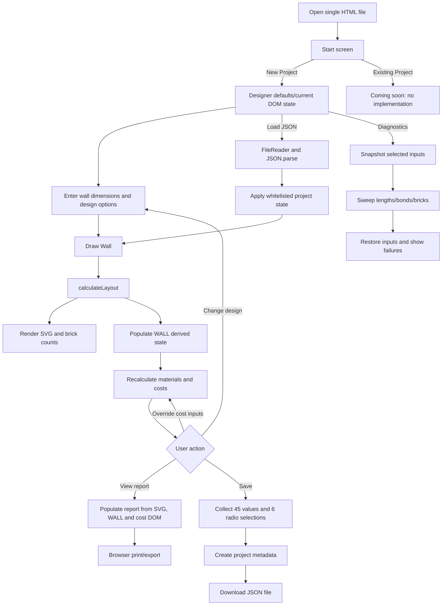
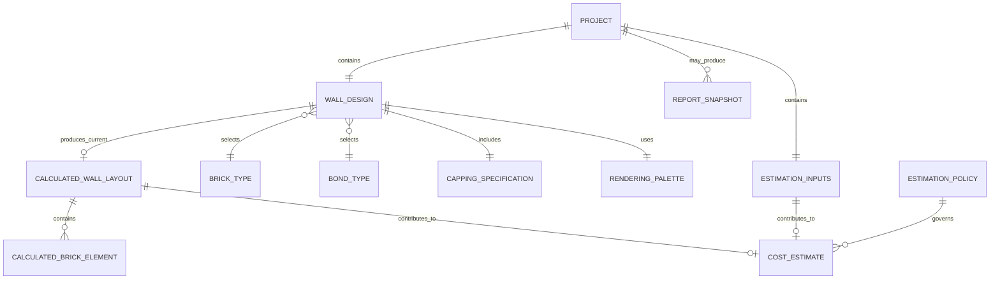

# Brick Wall Designer — Application and Conceptual Data Analysis

> Analysis target: `BrickWallDesigner_v18.html`. Evidence comes from HTML controls, embedded JavaScript, Save/Load JSON, and calculation/rendering functions.  
> Status: **Confirmed** = directly verified in source code; **Inferred** = inference supported by code evidence; **Unknown** = cannot be confirmed from the code.  
> This report stops at data discovery and conceptual modelling. It does not enter logical or physical database design, CMS Schema, API, or implementation work.

## 1. Primary Application Purpose, Users, and User Tasks

### 1.1 Primary Purpose

Brick Wall Designer is a single-file brick-wall design and estimation tool that runs in a browser. Using wall dimensions, brick type, mortar thickness, bond pattern, cut-brick settings, and capping options, it generates a schematic double-skin brick wall in SVG, actual dimensions, brick counts, material quantities, material and labour costs, GST, and a printable report. User inputs can be saved to and restored from a JSON file. **Confirmed**: pages L967-L2144; `calculateLayout` L2948; `drawWall` L5257; `recalculateCosts` L5534; `saveProject` L2771; `loadProject` L2802.

### 1.2 Users and Participants

| User/participant | Role confirmed by code | Status and evidence |
|---|---|---|
| Browser user | Enters design and cost parameters, draws the wall, reviews reports, and saves/loads projects | **Confirmed**: UI controls and event handlers. The code has no login or identity model, so this participant can only be described as an anonymous browser user. |
| Application calculation engine | Calculates layout, brick counts, material quantities, labour/material costs, and GST | **Confirmed**: `calculateLayout`, `drawWall`, and `recalculateCosts`. |
| Application maintainer | Maintains brick types, bond labels, default parameters, and algorithms by editing source code | **Inferred**: these values are hard-coded and have no management UI. |
| Owner, estimator, or design-support user | Possible real-world user types | **Inferred**: supported by the functionality and help text, but not formally defined in code. |
| Customer, site, or project owner | Not modelled; client/site appear only as examples in project-naming help | **Unknown**: L2078-L2083. These cannot be treated as established business roles. |

### 1.3 User Tasks

| User task | Result | Evidence |
|---|---|---|
| Start a new project | Opens the Designer with the current/default state | `NEW PROJECT` L982-L986; calls only `showPage(1)` and does not clear existing values |
| Configure the wall design | Enters dimensions, brick type, bond, cut-brick, and capping options | L1022-L1123 |
| Draw/recalculate the wall | Produces SVG, actual dimensions, brick counts, and `WALL` state | `drawWall` L5257-L5502 |
| Adjust costing parameters | Overrides RenoPilot defaults with user-entered values and recalculates immediately | `u_*` controls; `userOrDefault` L5514-L5520 |
| Review materials and costs | Reviews footing, steel, bricks, mortar, materials, labour, GST, and total cost | `recalculateCosts` L5534-L5755 |
| View/print report | Clones the current SVG and cost summary and invokes browser printing | `populateReport` L2590; `printReport` L2484 |
| Save project | Downloads JSON containing metadata and input state | `saveProject` L2771-L2800 |
| Load project | Reads local JSON, restores whitelisted inputs, redraws, and recalculates | `loadProject` L2802-L2835; `applyProjectState` L2719-L2744 |
| Run integrity diagnostics | Batch-tests wall length, bond, brick type, and mortar combinations | `runWallIntegrityTest` L4827-L4915 |
| Zoom/fit drawing | Changes display scale without changing the business design | `zoom`, `fitToWindow` L5764-L5775 |

## 2. Workflows

### 2.1 Workflow Table

| Workflow | Trigger/UI | Main functions | Input/state changes | Persistence | Evidence |
|---|---|---|---|---|---|
| Start / New Project | Start-screen button | `showPage(1)` | Shows Designer; does not reset the existing DOM | None | L982-L986, L2625-L2650 |
| Configure Design | Designer inputs | getters | Changes DOM inputs | Enters state on Save | L1022-L1123, L2197-L2215 |
| Draw/Recalculate | Draw Wall | `drawWall`→`calculateLayout`→`renderWall`→`recalculateCosts` | Rebuilds layout, SVG, counts, `WALL`, and costs | Derived values are not saved | L2948, L5257-L5502 |
| Configure Costs | Page 2 `u_*` | `userOrDefault`,`recalculateCosts` | Blank uses default; zero is a valid override | Raw values of 34 overrides are saved | L5514-L5755, L2655-L2701 |
| View Report | nav3 | `showPage(3)`,`populateReport` | Clones SVG and reads `WALL` and cost DOM | None | L2590-L2646 |
| Print/Export Report | Print buttons | `printReport` | Builds temporary HTML and invokes browser print | Report object is not saved by the app | L2484-L2588 |
| Save Project | Project name + Save | `collectProjectState`,`saveProject` | Creates project root and state | Downloads JSON Blob | L2704-L2717, L2771-L2800 |
| Load Project | JSON file + Load | `loadProject`,`applyProjectState` | Replaces whitelisted values, triggers change events, redraws/recalculates | Reads selected file | L2719-L2744, L2802-L2835 |
| Diagnostics | Diagnostic modal | `runWallIntegrityTest`,`checkLayoutIntegrity` | Snapshots some inputs, substitutes test values in batches, restores them | Not saved | L4778-L4915 |
| Reset/Delete | No implementation | — | Start only returns to the overlay; no project or individual-brick deletion | None | `showStartScreen` L2648-L2650 |

### 2.2 Overall Flowchart



## 3. All Input Fields and Values

Buttons are not data fields. `Persisted` indicates whether the current Save JSON includes the value. Cost inputs start blank in HTML; calculation uses the code default through `userOrDefault`, while an explicit user-entered `0` overrides the default. **Confirmed**: L5514-L5520.

### 3.1 Design Inputs and Hidden Configuration

| Field | UI type | Values/range/default | Condition or meaning | Persisted | Evidence |
|---|---|---|---|---|---|
| `WL` | number | 100..50000 mm; default 1235 | Entered wall length | Yes | L1024; `getWallLength` L2205 |
| `WH` | number | 100..10000 mm; default 1750 | Entered wall height | Yes | L1027; L2206 |
| `MJ` | number | 0..30 mm; default 10 | 0/blank/NaN falls back to 10 during calculation | Yes | L1030; L2200 |
| `BT` | select | s, l, u, m, r; first/default s | Brick-type code | Yes | L1035-L1041; L2150-L2163 |
| `cu` | radio | y/n; default n | Whether cut bricks are allowed | Yes | L1048-L1050; L2201-L2202 |
| `ad` | radio | s/l; default s | Adjust to a shorter/longer wall when cuts are disabled | Yes | L1055-L1058; L2203-L2204 |
| `bond` | radio | stretcher/header/english/englishGardenWall/flemish/flemishGardenWall/common; default stretcher | Bond pattern | Yes | L1063-L1076; L2208-L2209 |
| `cc` | radio | y/n; default n | Whether a capping course is included | Yes | L1083-L1085; L2210-L2211 |
| `cco` | radio | flat/vertical/soldier; default flat | Effective only when cc=y | Yes | L1091-L1096; L2214-L2215 |
| `ccoff` | radio | y/n; default n | Offset capping end bricks; effective only when cc=y | Yes | L1102-L1104; L2212-L2213 |
| `sk_hidden` | hidden | 2 | Saved, but `getSkinCount()` always returns 2 | Yes | L1113; L2207 |
| `C1` | hidden | `#C1440E` | Odd stretcher colour | Yes | L1115; `renderWall` L4999-L5007 |
| `C2` | hidden | `#A63A0C` | Even stretcher colour | Yes | L1116; L4999-L5007 |
| `C3` | hidden | `#8B6914` | Special-brick colour | Yes | L1118; L4999-L5007 |
| `C4` | hidden | `#AE0000` | Cut/capping-cut colour | Yes | L1119; L4999-L5007 |
| `C5` | hidden | `#D4C8B0` | Mortar colour | Yes | L1120; L5008 |
| `C6` | hidden | `#8B3A0C` | Header colour | Yes | L1117; L4999-L5007 |
| `CHR` | hidden | `#710000` | Capping colour | Yes | L1121; L4998-L5007 |

### 3.2 Material, Engineering, and Cost Override Inputs

| Field | Business meaning | Unit | HTML values | Code default when blank | Persisted | Evidence |
|---|---|---|---|---:|---|---|
| `u_side_clear` | Work-area side clearance | mm | ≥0 | 1500 | Yes | L1276; L5552 |
| `u_end_clear` | Work-area end clearance | mm | ≥0 | 2000 | Yes | L1286; L5553 |
| `u_footing_ext` | Footing extension | mm | ≥0 | 100 | Yes | L1331; L5566 |
| `u_footing_ratio` | Wall-height to footing-depth ratio | N/A | ≥0 | 4 | Yes | L1354; L5573-L5574 |
| `u_mesh_inset` | Reinforcement mesh inset | mm | ≥0 | 50 | Yes | L1388; L5583 |
| `u_mesh_layers` | Mesh layer count | count | ≥0 | 2 | Yes | L1411; L5591 |
| `u_roadbase_depth` | Road-base depth | mm | ≥0 | 100 | Yes | L1433; L5594 |
| `u_compact_factor` | Compaction factor | percent | 0..100 | 10 | Yes | L1474; L5602-L5603 |
| `u_steel_len` | Length of one reinforcing bar | m | ≥0 | 8 | Yes | L1501; L5611 |
| `u_brick_contingency` | Brick contingency | percent | ≥0 | 10 | Yes | L1538; L5619 |
| `u_mortar_contingency` | Mortar contingency | percent | ≥0 | 10 | Yes | L1566; L5635 |
| `u_mix_cement` | Cement parts in mortar mix | count | ≥0 | 1 | Yes | L1583; L5643 |
| `u_mix_lime` | Lime parts in mortar mix | count | ≥0 | 0 | Yes | L1591; L5644 |
| `u_mix_sand` | Sand parts in mortar mix | count | ≥0 | 4 | Yes | L1599; L5645 |
| `u_cost_rb` | Road-base unit cost | currency/m³ | ≥0 | 50 | Yes | L1647; L5667 |
| `u_cost_steel` | Reinforcing-steel unit cost | currency/length | ≥0 | 18 | Yes | L1655; L5668 |
| `u_cost_conc` | Concrete unit cost | currency/m³ | ≥0 | 400 | Yes | L1665; L5669 |
| `u_cost_brick` | Unit brick cost | currency/brick | ≥0; step .01 | 2.00 | Yes | L1673; L5670 |
| `u_cost_cement` | Cement unit cost | currency/kg | ≥0; step .01 | 0.50 | Yes | L1683; L5671 |
| `u_cost_lime` | Lime unit cost | currency/kg | ≥0; step .01 | 1.10 | Yes | L1691; L5672 |
| `u_cost_sand` | Sand unit cost | currency/kg | ≥0; step .01 | 0.10 | Yes | L1699; L5673 |
| `u_allow_site` | Site-access allowance | currency | ≥0 | 0 | Yes | L1737; L5701 |
| `u_allow_waste` | Waste-disposal allowance | currency | ≥0 | 0 | Yes | L1753; L5702 |
| `u_lab_prepare` | Work-area preparation labour rate | currency/m² | ≥0 | 0 | Yes | L1773; L5703 |
| `u_lab_trench` | Trench excavation labour rate | currency/m³ | ≥0 | 50 | Yes | L1781; L5704 |
| `u_lab_compact` | Road-base compaction labour rate | currency/m² | ≥0 | 20 | Yes | L1789; L5705 |
| `u_lab_pour` | Concrete-pour labour rate | currency/m² | ≥0 | 50 | Yes | L1797; L5706 |
| `u_lab_lay` | Bricklaying labour rate | currency/brick | ≥0; step .01 | 2.00 | Yes | L1805; L5707 |
| `u_min_prepare` | Work-area preparation minimum charge | currency | ≥0 | 0 | Yes | L1821; L5709 |
| `u_min_trench` | Trench excavation minimum charge | currency | ≥0 | 500 | Yes | L1834; L5710 |
| `u_min_compact` | Compaction minimum charge | currency | ≥0 | 0 | Yes | L1844; L5711 |
| `u_min_pour` | Concrete-pour minimum charge | currency | ≥0 | 500 | Yes | L1857; L5712 |
| `u_min_lay` | Bricklaying minimum charge | currency | ≥0 | 1000 | Yes | L1870; L5713 |

### 3.3 Project File and Diagnostic Inputs

| Field | Type | Values/default | Persisted | Evidence |
|---|---|---|---|---|
| `sp_name` | text | User-entered; must be nonblank after trim to Save | Yes, as root `projectName` | L2052-L2065; L2771-L2785 |
| `sp_load_file` | file | `.json,application/json` | No; import only | L2117-L2127; L2802-L2835 |
| `DIAG_MIN` | number | 100..49000; default 600 mm | No | L928; L4830 |
| `DIAG_MAX` | number | 200..50000; default 10000 mm | No | L932; L4831 |
| `DIAG_STEP` | number | 0.1..500; step .1; default 1 mm | No | L936; L4832 |
| `DIAG_MORTAR` | number | 0..30; default 17 mm | No | L940; L4833 |
| `DIAG_ALLBONDS` | checkbox | default false | No | L945; L4834 |
| `DIAG_ALLBRICKS` | checkbox | default false | No | L951; L4835 |
| `DIAG_CUTS_ONLY` | checkbox | default true | No | L957; L4836 |

## 4. Data Dictionary

### 4.1 Save JSON Structure

```text
project
├─ appName: "Brick Wall Designer"
├─ appVersion: "v16"
├─ projectName: user text
├─ savedAt: ISO datetime
└─ state
   ├─ values: 45 DOM value strings
   └─ radios: 6 selected radio strings
```

**Confirmed**: `collectProjectState` L2704-L2717; `saveProject` L2771-L2800. Numeric fields are strings in JSON because Save reads DOM `.value`; types below are business-semantic types.

| Data item/path | Business type | Unit | Required/default semantics | Allowed values | Load behaviour | Evidence |
|---|---|---|---|---|---|---|
| `project.appName` | string | N/A | Always emitted by Save | Brick Wall Designer | Not read or validated | L2780, L2812-L2822 |
| `project.appVersion` | string | N/A | Fixed v16 | v16 currently | Not read or validated | L2781 |
| `project.projectName` | string | N/A | Nonblank before Save; JSON value has no length limit | user text | Restored to `sp_name` | L2772-L2783, L2814 |
| `project.savedAt` | datetime string | N/A | Browser-generated | ISO-8601 | Formatted for display only | L2783, L2819-L2821 |
| `state.values.BT` | enum string | N/A | default s | s/l/u/m/r | Assigned from whitelist, then reference lookup | L2655-L2709, L2721-L2725 |
| `state.values.MJ/WL/WH` | decimal strings | mm | HTML defaults plus getter fallbacks | Section 3 ranges | Assigned to DOM, then recalculated | same; L2200-L2206 |
| `state.values.C1..C6/CHR` | colour strings | N/A | Fixed hidden defaults | unvalidated hex strings | Assigned to DOM and used by render | L2660-L2666, L4997-L5008 |
| `state.values.sk_hidden` | integer-like string | count | default 2 | effectively 2 | Restored to DOM; calculation ignores non-2 values | L2667, L2207 |
| `state.values.u_*` (34 fields) | decimal/blank strings | See 3.2 | blank=use code default; 0=explicit override | generally HTML ≥0 | Restored, then `recalculateCosts` | L2668-L2700, L5514-L5755 |
| `state.radios.bond` | enum | N/A | default stretcher | 7 bond codes | Exact radio match | L2702, L2727-L2739 |
| `state.radios.cu/cc/ccoff` | boolean-like enum | N/A | default n | y/n | Exact match and change event | same |
| `state.radios.ad` | enum | N/A | default s | s/l | Exact match | same |
| `state.radios.cco` | enum | N/A | default flat | flat/vertical/soldier | Exact match and conditional UI update | same |

### 4.2 Reference Data

| Dataset | Code | Label/value | Dimensions/meaning | Evidence |
|---|---|---|---|---|
| Brick Type | s | Standard | 230×110×76 mm | `BRICK_TYPES`,`BRICK_NAMES` L2150-L2163 |
| Brick Type | l | Slimline | 290×90×47 mm | Same |
| Brick Type | u | Utility | 290×90×76 mm | Same |
| Brick Type | m | Modular | 190×90×90 mm | Same |
| Brick Type | r | Roman | 290×90×40 mm | Same |
| Bond Type | stretcher | Stretcher Bond | Layout algorithm branch | radios L1063-L1076; `NAMES` L5158-L5166 |
| Bond Type | header | Header Bond | Same | Same |
| Bond Type | english | English Bond | Same | Same |
| Bond Type | englishGardenWall | English Garden Wall Bond | Same | Same |
| Bond Type | flemish | Flemish Bond | Same | Same |
| Bond Type | flemishGardenWall | Flemish Garden Wall Bond | Same | Same |
| Bond Type | common | Common Bond (American) | Same | Same |
| Capping orientation | flat | Header on flat | unitW=brick.w; rowH=brick.h | `cappingDimensions` L2230-L2236 |
| Capping orientation | vertical | Header on edge | unitW=brick.h; rowH=brick.w | Same |
| Capping orientation | soldier | Stretcher on end | unitW=brick.h; rowH=brick.l | Same |
| Adjustment direction | s/l | Shorter/Longer | Actual-length adjustment when cuts are disabled | L1055-L1058 |
| Boolean-like flags | y/n | Yes/No | cu, cc, ccoff | Corresponding radios/getters |

### 4.3 Main Derived Data

| Derived item | Type/unit | Calculation source | Recalculable | Currently saved | Evidence |
|---|---|---|---|---|---|
| Actual wall length, height, and double-skin width | decimal/mm | layout, brick width, mortar | Yes | No | `WALL.length/height/width` L5475-L5478 |
| Counts by brick category and total | integer/count | Layout brick categories and skin/type multipliers | Yes | No | L5408-L5497 |
| Bricks to order including contingency | integer/count | `ceil(WALL.total×(1+contingency))` | Yes | No | L5619-L5621 |
| Work area, wall footprints, footing area/depth/volume | decimal/m²/mm/m³ | WALL dimensions and engineering overrides | Yes | No | L5551-L5580 |
| Mesh dimensions and steel-bar count | decimal/integer | footing, inset, layers, bar length | Yes | No | L5582-L5614 |
| Excavation and road-base volumes | decimal/m³ | footing footprint, depths, compaction | Yes | No | L5593-L5608 |
| Mortar volume and cement/lime/sand masses | decimal/m³/kg | brick geometry, mortar, mix, densities | Yes | No | L5623-L5664 |
| Seven material costs and total | decimal/currency | material quantity × unit cost | Yes | No | L5666-L5698 |
| Site/waste and five labour costs and total | decimal/currency | allowances; max(quantity×rate, minimum) | Yes | No | L5700-L5748 |
| GST component | decimal/currency | grand total / 11 | Yes | No | L5750-L5754 |
| Grand total | decimal/currency | materialsTotal + labourTotal | Yes | No | L5750-L5751 |
| SVG/report | SVG/HTML | layout, WALL, cost DOM | Yes | No (browser print only) | L2484-L2623, L4997-L5144 |

## 5. Conceptual Business Entity Identification Diagram

> **Candidate business entities are not final database tables.** Calculated, Estimate, and Report concepts in the diagram are current derived objects or future snapshot candidates; their presence does not approve persistence.



| Conceptual entity | Meaning | Identity/lifecycle evidence | Status |
|---|---|---|---|
| Project | Named JSON save boundary | No stable ID; Save creates and Load reads a file | **Confirmed** |
| Wall Design | Wall dimensions and design options | No independent ID; modified as part of Project state | **Confirmed** |
| Estimation Inputs | 34 engineering, pricing, labour, and minimum-charge overrides | No independent ID; saved with project | **Confirmed** |
| Brick Type | Brick code, name, dimensions | Five hard-coded reference records | **Confirmed** |
| Bond Type | Bond code, label, algorithm selection | Seven allowed values | **Confirmed** |
| Capping Specification | include, orientation, offset | Value-object candidate within design | **Confirmed** |
| Rendering Palette | Seven brick/mortar colours | Hidden inputs saved with project | **Confirmed** |
| Calculated Wall Layout | Actual dimensions, courses, brick graphics, counts | Created after Draw; replaced on recalculation; not saved | **Confirmed derived** |
| Estimation Policy | Default engineering values, rates, densities, GST | Currently hard-coded with no ID/version | **Inferred conceptual candidate** |
| Cost Estimate | Material quantities, costs, GST, total | Replaced on each recalculation; not saved | **Confirmed derived / entity status Inferred** |
| Report Snapshot | Printed SVG and cost summary | Generated on demand and unmanaged by the app | **Inferred** |
| User/Customer/Site | Potential business subjects | No code data structures | **Unknown** |

## 6. Entity Relationships and Cardinality

| Business relationship | Cardinality/optionality | Ownership/dependency | Evidence and status |
|---|---|---|---|
| Project contains Wall Design | Current 1:1, required | Wall Design is saved with Project state | Save JSON shape, **Confirmed** |
| Project contains Estimation Inputs | Current 1:1; each override may be blank | Saved with Project | `PROJECT_VALUE_IDS`, **Confirmed** |
| Wall Design selects Brick Type | Exactly 1 per Design; each type may serve 0..many designs | Design references code | `BT`/`BRICK_TYPES`, **Confirmed** |
| Wall Design selects Bond Type | Exactly 1 per Design; each bond may serve 0..many designs | Design references code | `bond` radios, **Confirmed** |
| Wall Design contains Capping Specification | 1:1; orientation/offset remain saved but inactive when cc=no | Part of Design | `cc`,`cco`,`ccoff`, **Confirmed** |
| Wall Design uses Rendering Palette | Current 1:1 | Part of Design/Project | Hidden colours in saved state, **Confirmed** |
| Wall Design produces Calculated Wall Layout | 0..1 current layout; 0 before Draw | Derived and replaced on recalculation | `lastLayout`,`WALL.ready`, **Confirmed** |
| Calculated Layout contains Calculated Brick Elements | 0..many | Purely derived; not independently maintained | `wallBricks`,`ccBricks`, **Confirmed** |
| Layout + Estimation Inputs produce Cost Estimate | 0 before Draw; 1 current result for valid layout | Depends on both inputs and default rules | `recalculateCosts`, **Confirmed** |
| Estimation Policy governs Cost Estimate | One current default rule set applies to all estimates | No independent persistent object | Hard-coded defaults, **Inferred** |
| Project and historical versions/report snapshots | Unsupported today; future cardinality unknown | Unknown | No persistent history evidence, **Unknown** |
| Project and User/Customer/Site | Unknown | Unknown | Not modelled in code, **Unknown** |

## 7. Application Understanding from a Database-Design Perspective

### 7.1 Current Data Boundary and Source of Truth

| Observation | Conceptual database-design meaning | Evidence |
|---|---|---|
| Project JSON is the only explicit persistence boundary | User-authored, non-reconstructable data consists of project metadata, design inputs, colours, and 34 estimation overrides | `saveProject`, `collectProjectState` |
| Active DOM is current state while editing | JSON is an offline snapshot, not a managed shared record; multiple file copies may diverge | collect/apply directly read/write DOM |
| Brick/Bond/defaults reside in source | Reference/configuration data has different ownership and update cadence from project data | `BRICK_TYPES`,`NAMES`,`userOrDefault` literals |
| Layout, counts, materials, and costs are recalculable | They are not current core persistent inputs; snapshot needs depend on historical-reproduction requirements | `drawWall`,`recalculateCosts`; Save excludes these objects |
| appVersion is written but not read | The file currently lacks effective schema/version compatibility control | L2781; Load L2812-L2822 |

### 7.2 Confirmed Persistence Requirements

- Project name, save time, and complete design inputs must survive sessions. **Confirmed** by Save/Load UI and implementation.
- 45 `state.values` and 6 `state.radios` are the current persisted scope. **Confirmed**: L2655-L2717.
- Blank cost overrides must remain distinct from numeric zero: blank invokes the code default; zero overrides it. **Confirmed**: `userOrDefault` L5514-L5520.
- Brick Type, Bond Type, and Capping codes must remain stable or old JSON cannot be restored correctly. **Inferred requirement**, based on exact Load matching with no migration.
- Whether derived results require historical snapshots cannot be determined from current code. **Unknown**.

### 7.3 Data Quality and Modelling Risks

| Risk | Factual evidence | Status |
|---|---|---|
| Version inconsistency | Filename v18, title/start/save v16, provenance v15 | **Confirmed / High** |
| Numbers saved as strings | `collectProjectState` reads `.value` | **Confirmed / High** |
| Import has no schema/type/range/version validation | `JSON.parse` followed directly by `applyProjectState(project.state)` | **Confirmed / High** |
| Blank, zero, and missing differ | Blank→default; zero valid; missing Load key retains current UI | **Confirmed / High** |
| Duplicate reference definitions | Bricks in select/BRICK_TYPES/BRICK_NAMES; bonds in radios/array/NAMES | **Confirmed / High** |
| Display defaults and calculation defaults are distributed | UI text and JS literals are maintained separately | **Confirmed / High** |
| Mixed units | mm, m, m², m³, kg, count, $ | **Confirmed / High** |
| Currency/region/effective date absent | Only `$` and GST text are shown | **Confirmed gap / High** |
| Import may create orphaned references | Unknown BT/bond values are not validated | **Confirmed risk / High** |
| Derived-result drift | Old files retain only inputs; new code/defaults recalculate results | **Confirmed mechanism / High inferred consequence** |
| `sk_hidden` saved but does not control calculation | Getter always returns 2 | **Confirmed / Medium** |
| No stable project ID, owner, or audit | JSON contains only name/time/app metadata/state | **Confirmed gap; requirement Unknown** |

### 7.4 Questions to Resolve Before the Next Phase

| Question | Impact | Evidence status |
|---|---|---|
| Is the authoritative application/save-format version v18, v16, or another value? | Compatibility and calculation traceability | **Unknown**; three identifiers conflict |
| Does a Project always contain exactly one wall? | Conceptual relationships and aggregate boundary | **Unknown**; current JSON supports only one |
| Are User, Customer, Site, Organisation, and permissions required? | Ownership, queries, and access scope | **Unknown**; absent from code |
| What currency, region, and GST rules apply to `$`? | Meaning of all monetary fields | **Unknown** |
| What are the sources, approvers, and effective dates of default prices, densities, and engineering parameters? | Configuration credibility and versioning | **Unknown** |
| Must an old project reproduce its original material quantities and costs? | Need for algorithm/configuration version or result snapshot | **Unknown** |
| Do Project, Estimate, and Report require history, archival, deletion, and audit? | Persistence scope | **Unknown** |
| Should invalid or legacy JSON be rejected, repaired, or accepted with warnings? | Import integrity rules | **Unknown** |
| What is the exact business unit of steel `currency/length`? | Unit-cost definition | **Unknown** |
| What are the actual project volume, concurrency, sharing, and batch requirements? | Later capacity and access design | **Unknown** |

### 7.5 Scope Conclusion

The current application is a local-browser model consisting of “one named project file + one wall-design state + one set of cost overrides + reference/configuration embedded in source + recalculable outputs.” This conclusion is directly supported by the Save JSON, input whitelist, and calculation paths. Users, customers, sites, approvals, historical versions, shared collaboration, and a centralised project repository are not implemented and cannot be treated as confirmed requirements.

**This report stops at conceptual data discovery. Without explicit approval, no logical database design, physical database design, CMS Schema, API, or implementation phase may begin.**
